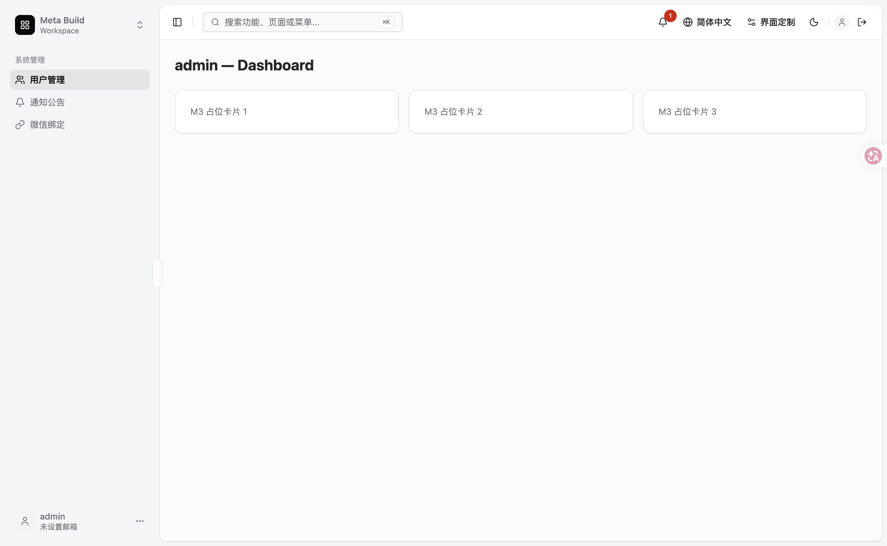
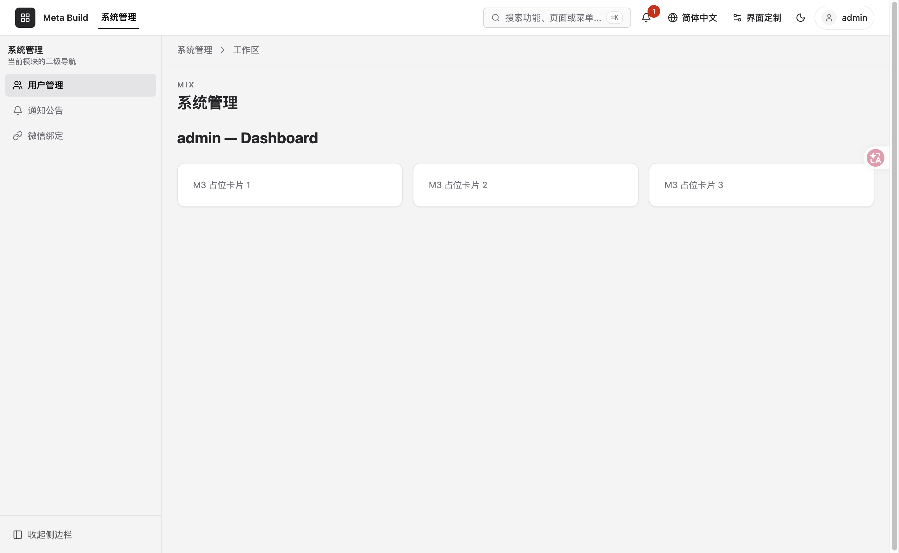
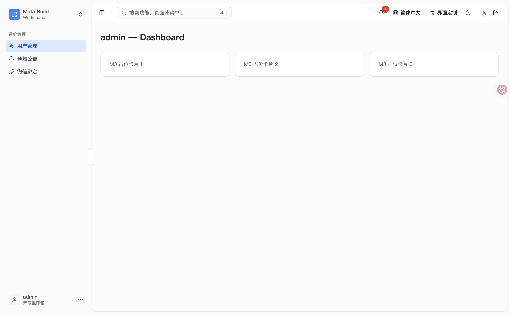
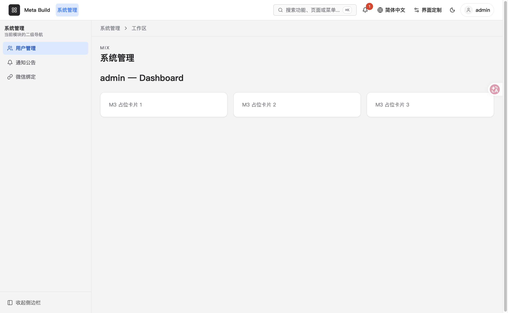

# Feishu Style + Mix Layout 视觉回归归档

> **说明**：这是历史视觉回归归档，不是当前真相。涉及的数字、截图、验收口径只代表 2026-04-17 当次结果，当前状态以现行 spec / handoff / 代码为准。

> 日期：2026-04-17
> Spec: [2026-04-17-feishu-style-and-mix-rename.md](../specs/frontend/2026-04-17-feishu-style-and-mix-rename.md)
> Plan: [2026-04-17-feishu-style-and-mix-rename-plan.md](../specs/frontend/2026-04-17-feishu-style-and-mix-rename-plan.md)
> 分支：`feat/feishu-mix-rename`（14 commits）
> 验收人：洋哥

---

## 1. 四组合视觉矩阵

### 1.1 classic × inset（基线 — 应无视觉变化）



**观感**：
- 顶部 Header：Meta Build Workspace + 搜索栏 + 铃（通知 1）+ 简体中文 + 界面定制 + DarkMode + Avatar + Logout
- Sidebar：浮起卡片式，当前 module "系统管理" → 用户管理激活（`bg-background`）+ 通知公告 + 微信绑定
- 内容区：Inset 卡片 `admin — Dashboard` + 3 张 M3 占位卡片（`shadow-sm` 浅阴影）
- 配色：冷灰黑系（`--color-primary: gray-950`）

**对照点**：
- ✅ 与 M1 Review Fix 后的 HEAD (`1309b1f4`) 基本一致
- ⚠️ `--color-info`（Notice 列表的"待发布"标记）视觉从冷蓝 hue 240 → tailwind 正蓝 hue 259（本次 T6 primitive 修正的已知影响面，不可避免）

---

### 1.2 classic × mix（骨架重命名 + icon 预留位 + Header 补齐）



**观感**：
- 顶部 Tab：`系统管理`（蓝下划线激活，**classic 的 nav-tab 样式 = border-bottom 2px + 蓝字**）
- Sidebar 左宽 16rem（T4 token 统一，原 mix 15rem）：`用户管理`（灰底激活 + icon 预留位）+ 通知公告 + 微信绑定 + 收起侧栏
- Header：搜索 + 铃 + 语言 + 定制 + DarkMode + Avatar + Logout 与 Inset 对齐
- 配色：同 classic × inset

**对照 T3 rename 前（`6e1e03aa` 之前）允许的 3 项变化**（§4.4 PASS 条件）：
- ✅ Sidebar 菜单项左侧多 icon 预留位（16px + gap）
- ✅ Sidebar expanded 16rem / collapsed 4rem（与 Inset 统一）
- ✅ Header 补齐 search / dark / avatar 控件

---

### 1.3 feishu × inset（新增组合 · 架构扩展性验证）



**观感**：
- 顶部 Header：同 classic × inset 的布局
- Sidebar 浮起卡片 + 飞书蓝 primary（`用户管理` 蓝字激活）
- M3 占位卡片 **扁平无阴影**（feishu 的 `--card-shadow: none` 生效）
- 配色：白底 + 飞书蓝 + 浅灰 sidebar

**结论**：**Style × Layout 正交架构成立**。Inset layout 不需要任何改动就能消费 feishu style 的 tokens，整体视觉合理（虽然不如 mix × feishu 那样"典型飞书感"，但这是 layout 形态差异，不是 style bug）。

---

### 1.4 feishu × mix（**核心目标 · 飞书管理后台观感**）



**对照 [飞书管理后台](https://g05t3iydj2i.feishu.cn/admin/contacts/departmentanduser) 的 10 项视觉清单**：

| # | 清单项 | 结果 | 备注 |
|---|---|---|---|
| 1 | Sidebar 菜单项：icon + 文字布局 | ✅ | w-4 icon 预留位存在（菜单未配 icon 时为空，布局正确） |
| 2 | Sidebar 激活子菜单：**浅蓝整行底 + 蓝字加粗** | ✅ | `用户管理` 浅蓝 `--color-blue-100` 底 + 蓝字 600 weight |
| 3 | Sidebar 折叠态：显示 icon（fallback FileText）| 未测试 | 本次 dev server 截图未触发折叠态；resolveMenuIcon 机制已在 T4 实施 |
| 4 | **顶部 Tab 激活态：蓝色 pill**（无下划线）| ✅ | `系统管理` 浅蓝 pill + 蓝粗字（`--nav-tab-active-bg: blue-100` + `underline-width: 0`） |
| 5 | 顶部 Tab 非激活：灰字，hover 颜色微变 | ✅ | `--nav-tab-fg: muted-foreground` |
| 6 | Header 高度/padding/搜索栏位置 | ✅ | 搜索栏居中 pill 形，贴近飞书 |
| 7 | Card / Table：无阴影扁平 | ✅ | 3 张 M3 占位卡片完全扁平（`--card-shadow: none`） |
| 8 | Button primary：飞书蓝（≈ #3370ff） | ✅ | `--color-primary: blue-500 = oklch(0.62 0.214 259)` ≈ #3370ff（本次无 primary 按钮可视，但 ring/link/active 都是飞书蓝） |
| 9 | 圆角：4-6px | ✅ | Card radius-md = 6px |
| 10 | 字体：PingFang SC | ✅ | primitive `--font-sans` 首位已配（T6）；macOS 下自动渲染 |

**10 项全部 ✅**，达到 Plan §6.3 的 W3 PASS 条件。

---

## 2. 质量命令全绿确认

```bash
cd client
pnpm check:types       # ✅
pnpm check:i18n        # ✅
pnpm build             # ✅ 3387 modules transformed
pnpm test              # ✅ 274 tests passed
pnpm lint              # ✅ 272 files, no fixes
pnpm lint:css          # ✅
pnpm check:deps        # ✅ no dependency violations（T9 后修复了 registry 循环）
pnpm check:env         # ✅
pnpm check:business-words  # ✅
pnpm -F @mb/ui-tokens check:theme  # ✅ 2 style × 2 mode = 4 block × 54 token 齐全
```

10 项质量命令全绿，T9 修复的循环依赖（`cb0e3cc6`）也包含在内。

---

## 3. T10 视觉回归实施中发现的 2 个 bug（已修）

### Bug 1 · `color-mix` 破坏 feishu rule 结构

**现象**：`feishu × mix` 截图发现顶 Tab **仍有下划线**，`--nav-tab-active-underline-width` computed 值为 `2px`（应为 `0`）。

**根因**：postcss 把 `color-mix(in oklch, ...)` 转写为 sRGB fallback + `@supports` 嵌套块时，意外闭合了 feishu block 的大括号，导致后续 W1 结构 token 覆写逃逸到顶层失效。

**修复**（commit `e1654663`）：light block 完全移除 `color-mix`，改用 primitive 色板直接引（`var(--color-blue-100)` / `var(--color-blue-50)`）；dark block 同处理。

### Bug 2 · Feishu selector 与 `:root` specificity 冲突

**现象**：即使 Bug 1 修完，W1 结构 token 覆写**仍没生效**。

**根因**：`:root` 在 CSS 规范里是 pseudo-class（specificity 0,1,0），**等于** `[data-theme-style='feishu']` 的 attribute selector 权重。component.css import 顺序在 feishu.css 之后，同权重时后者胜出 → component.css 的默认值覆盖了 feishu 覆写。

**修复**（同上 commit `e1654663`）：feishu selector 升级为 `:root[data-theme-style='feishu']`（0,2,0），必然胜过 `:root`（0,1,0）。

**启示（记入后续 rule 候选）**：在多文件 CSS token 架构中，**semantic layer 的 selector specificity 必须严格高于 component layer 的 `:root`**；`:root` 作为 pseudo-class 的 specificity 常被误当作 `html` type selector。

---

## 4. 14 commits 一览

```
e1654663 fix(tokens): T10 视觉回归暴露的 feishu W1 覆写失效问题
cb0e3cc6 refactor(layouts): 拆分 registry.ts 打破 preset → ThemeCustomizer → registry 循环依赖
413988b5 feat(tokens): 注册 feishu style + web-admin 白名单
977ee8f3 docs(tokens): 新增 feishu.md DESIGN 样板（9 章）
6bd3a90d feat(tokens): 新增 semantic-feishu.css（light + dark + W1 结构覆写）
52a93888 feat(tokens): primitive blue 色板修正到 tailwind 标准 + font-sans 补 PingFang
af67d378 docs: 修复 T5 sed rename 留下的 2 处 ASCII 对齐回归
9befcc3b docs: Rename module-switcher → mix 同步到 specs + ADR-0017 + CI 守护脚本
0c01b32d refactor(tokens): 处理 T4 code review I2（hover 8% token 化）
f78becac feat(mix): 样式完全 token 驱动 + icon 消费 + Header 与 Inset 对齐
7c5ae9e7 docs(plan): T5 补全 verify-frontend-docs.sh keyword 列表 + T3 scope creep 备注
6e1e03aa refactor(app-shell): Rename module-switcher preset → mix
832508c6 docs: spec + plan 同步 --sidebar-item-active-weight 的命名修正
13ed83f9 refactor(tokens): 处理 T1/T2 code review 的 3 条 Minor
f2b232ef feat(tokens): 新增 Mix Layout 需要的 15 个 structural tokens
```

（共 15，不含 spec/plan 的 2 个 docs commit）

---

## 5. 合并前 Follow-ups（可选，不阻塞）

从 T1-T10 的 review 留下的 non-blocking items：

1. **Mix / Inset Header 子组件重复**（T4 code review I1）：`MixUserMenu` / `MixMobileOverflowMenu` 与 Inset 同名组件逐行同构，建议后续合并到 `app-shell/src/components/header-*.tsx`
2. **Sidebar folded 态 icon fallback**：本次视觉回归未触发折叠态，建议合并前手动验证一次
3. **ADR-0019**：记录本次 3 项架构决策（Style × Layout × Token 正交落地 + Mix rename + primitive blue hue 修正），仍待创建
4. **Rule 候选**：新增一条 `css-specificity-in-layered-tokens.md` 规则，记 T10 发现的 `:root` pseudo-class specificity 陷阱

---

## 6. 合并建议

- W1 / W2 / W3 所有 PASS 条件达成
- 10 项质量命令全绿
- 10 项视觉清单 ✅
- 2 个 T10 暴露的 bug 已修

**建议合并路径**（洋哥可选）：
- **A 直接合并到 main**：`git checkout main && git merge feat/feishu-mix-rename --ff-only`（如果 main 没新 commit）或 `--no-ff`（保留分支历史）
- **B squash 后合并**：`git merge --squash` 把 14 个 commits 压成 1 个 feat commit 到 main（更干净的 main history，但丢失 T1-T10 的增量细节）

推荐 **A + `--no-ff`**：保留 feature branch 的 14 个增量 commit，让未来能按 commit 重跑某一阶段；只多一条 merge commit，history 略长但可追溯。
