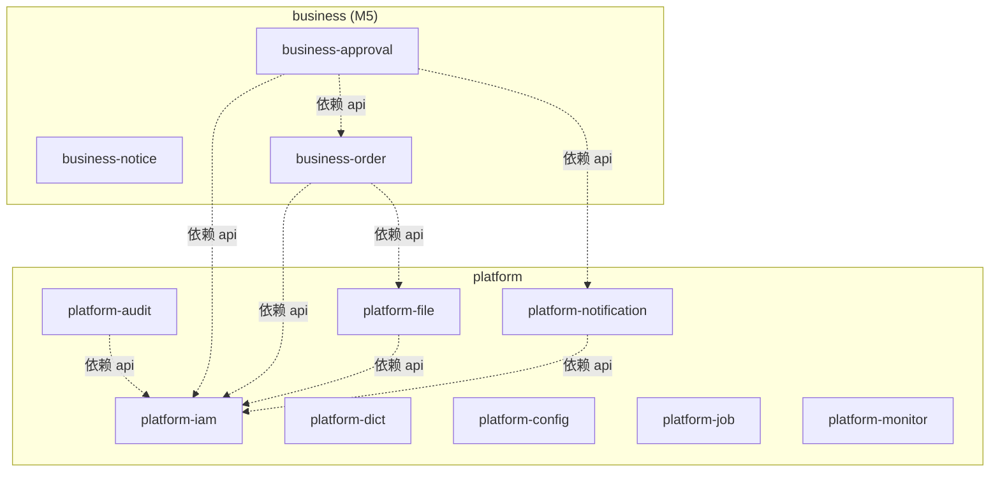

# 01 - 模块结构与边界守护

> **关注点**：6 层 Maven 模块结构、包命名、依赖方向硬约束、模块边界守护机制（Maven pom + ArchUnit 双保险）、跨模块通信（Spring 原生事件）。
>
> **本文件吸收原 backend-architecture.md 的 §1（项目结构）+ §2（模块边界守护）+ §5.2（跨模块走 api 子包反模式修复）**。

## 1. 6 层 Maven 模块 [M1]

### 1.1 决策结论

server 端采用 **6 层 Maven multi-module** 结构，依赖严格单向（ADR-0004）。每一层职责单一，命名空间对称，为 AI 阅读和扩展优化。

### 1.2 6 层 Maven 模块

```
server/
├── mb-common/          # 零 Spring 依赖，纯工具层
├── mb-schema/          # 数据库契约层（Flyway SQL + jOOQ 生成代码）★ ADR-0004 新增
├── mb-infra/           # 基础设施层 (10 个子模块 pom parent)
├── mb-platform/        # 平台业务层 (8 个平台模块 pom parent)
├── mb-business/        # 使用者扩展位 + M5 canonical reference ★ ADR-0004 新增
├── mb-admin/           # Spring Boot 启动入口 + Flyway runtime + 集成测试 + ArchUnit 测试
└── pom.xml             # 顶层 parent pom，BOM 版本管理
```

**每一层的"存在理由"（拿掉它会怎样）**：

| 层 | 职责 | 拿掉它会怎样 |
|---|------|------------|
| `mb-common` | 零 Spring 工具（异常基类、Snowflake ID、纯函数工具） | 其他层都要重复实现通用工具，或者反向依赖 Spring |
| `mb-schema` | 数据库契约（Flyway SQL + jOOQ 生成代码） | jOOQ 生成代码没地方放，Flyway 和生成代码会跨模块维护 |
| `mb-infra` | 基础设施能力（security/cache/jooq/i18n/async/rate-limit/observability 等） | 每个业务模块都要自己搞基础设施，代码重复爆炸 |
| `mb-platform` | meta-build 官方提供的稳定平台能力（iam/audit/file 等） | 使用者要自己从零实现用户、权限、审计等基础后台功能 |
| `mb-business` | 使用者自己的业务扩展（兼 M5 canonical reference 示例） | 使用者没有"合法"的业务扩展位置，只能污染 platform |
| `mb-admin` | Spring Boot 启动入口，聚合所有模块，承载 ArchUnit 测试 | 应用无法启动，架构测试没地方放 |

**依赖方向（单向，不可反转）**：

```
mb-common    ← 零 mb-* 依赖
mb-schema    ← 零 mb-* 依赖（只依赖 org.jooq runtime）
mb-infra     ← 依赖 mb-common
mb-platform  ← 依赖 mb-common + mb-infra + mb-schema
mb-business  ← 依赖 mb-common + mb-infra + mb-schema + mb-platform::api
mb-admin     ← 依赖所有上层模块（聚合启动 + ArchUnit 测试基地）
```

### 1.3 包命名规范

| 层 | 根包 | 示例 |
|---|---|---|
| common | `com.metabuild.common.<功能>` | `com.metabuild.common.exception.MetaBuildException`、`com.metabuild.common.security.CurrentUser`、`com.metabuild.common.security.DataScope` |
| schema | `com.metabuild.schema.<jooq 概念>` | `com.metabuild.schema.tables.SysIamUser` |
| infra | `com.metabuild.infra.<能力>` | `com.metabuild.infra.security.SaTokenCurrentUser`、`com.metabuild.infra.jooq.DataScopeVisitListener` |
| platform | `com.metabuild.platform.<域>.<子包>` | `com.metabuild.platform.iam.domain.user.UserService` |
| business | `com.metabuild.business.<域>.<子包>` | `com.metabuild.business.order.domain.OrderService` |
| admin | `com.metabuild.admin` | `com.metabuild.admin.MetaBuildApplication` |

**关键位置澄清**：`CurrentUser` / `DataScope` / `DataScopeType` / `BypassDataScope` 等**抽象接口和类型定义**在 `mb-common.security`；Sa-Token 相关的**实现类**（`SaTokenCurrentUser` / `SaTokenAuthFacade`）在 `infra-security`；**数据权限的 SQL 注入机制**（`DataScopeRegistry` / `DataScopeVisitListener` / `BypassDataScopeAspect`）在 `infra-jooq`。三层严格分工，见 §5.3 数据权限 opt-out 实现（方案 E）。

### 1.4 server/ 完整目录树

```
server/
├── pom.xml                                   # parent pom + BOM
│
├── mb-common/
│   ├── pom.xml
│   └── src/main/java/com/metabuild/common/
│       ├── exception/                        # MetaBuildException 基类层次
│       ├── id/                               # SnowflakeIdGenerator
│       ├── dto/                              # PageResult 等通用 DTO
│       ├── security/                         # ★ 公共抽象 + 类型定义（ADR-0005 + 方案 E）
│       │   ├── CurrentUser.java              #    认证读门面接口
│       │   ├── CurrentUserInfo.java          #    CurrentUser.snapshot() 的 DTO
│       │   ├── DataScopeType.java            #    数据范围枚举（ALL/CUSTOM_DEPT/OWN_DEPT/OWN_DEPT_AND_CHILD/SELF）
│       │   ├── DataScope.java                #    数据范围值对象（type + deptIds）
│       │   ├── BypassDataScope.java          #    @BypassDataScope 注解
│       │   └── LoginResult.java              #    登录返回值 record
│       ├── constant/                         # 全局常量
│       └── util/                             # 纯工具类（无 Spring 依赖）
│
├── mb-schema/                                # ★ 数据库契约层（ADR-0004）
│   ├── pom.xml                               # 含 jOOQ codegen profile
│   └── src/main/
│       ├── resources/db/migration/           # Flyway SQL 脚本
│       │   ├── V20260601_001__iam_user.sql        # 时间戳命名,ADR-0008
│       │   ├── V20260601_002__iam_role.sql
│       │   ├── V20260602_001__audit_log.sql
│       │   ├── V20260602_002__file_metadata.sql
│       │   ├── V20260603_001__notification.sql
│       │   ├── V20260603_002__dict.sql
│       │   ├── V20260603_003__config.sql
│       │   ├── V20260603_004__job.sql
│       │   ├── V20260603_005__shedlock.sql         # ShedLock 分布式锁表
│       │   ├── V20260603_006__monitor.sql
│       │   └── V20260605_001__init_data.sql
│       └── jooq-generated/                   # jOOQ 生成代码（入 git）
│           └── com/metabuild/schema/
│               ├── tables/                   # 表类型（SysIamUser、SysAuditLog 等）
│               ├── records/                  # Record 类
│               ├── keys/                     # 外键引用
│               └── indexes/                  # 索引引用
│
├── mb-infra/
│   ├── pom.xml                               # parent pom
│   ├── infra-security/                       # Sa-Token 实现：SaTokenCurrentUser + AuthFacade/SaTokenAuthFacade + @RequirePermission + CorsConfig
│   ├── infra-cache/                          # Redis + CacheEvictSupport
│   ├── infra-jooq/                           # JooqHelper + SlowQueryListener + DataScopeRegistry + DataScopeVisitListener + BypassDataScopeAspect（方案 E：数据权限的唯一归属，不含 jOOQ 生成代码）
│   ├── infra-exception/                      # GlobalExceptionHandler + ProblemDetail
│   ├── infra-i18n/                           # MessageSource + LocaleResolver
│   ├── infra-async/                          # AsyncConfig + 线程池 + 上下文传递
│   ├── infra-rate-limit/                     # Bucket4j
│   ├── infra-websocket/                      # v1 留空，v1.5 实施
│   ├── infra-observability/                  # Actuator + Micrometer + Logback JSON
│   └── infra-archunit/                       # ArchUnit 规则库（规则代码）
│
├── mb-platform/
│   ├── pom.xml                               # parent pom
│   ├── platform-iam/                         # 用户/角色/菜单/部门/权限/数据范围/会话
│   ├── platform-audit/                       # 审计日志
│   ├── platform-file/                        # 文件上传/存储
│   ├── platform-notification/                # 通知/站内信/邮件/短信
│   ├── platform-dict/                        # 字典管理
│   ├── platform-config/                      # 运行时配置
│   ├── platform-job/                         # 定时任务（Spring @Scheduled + ShedLock）
│   └── platform-monitor/                     # 服务器/慢查询监控
│
├── mb-business/                              # ★ 使用者扩展位（ADR-0004）
│   ├── pom.xml                               # parent pom
│   └── (v1 M1-M4: 空目录；M5 填入 canonical reference):
│       ├── business-notice/                  # M5 示例: 低复杂度 CRUD
│       ├── business-order/                   # M5 示例: 主从表 + 状态机
│       └── business-approval/                # M5 示例: 跨模块编排
│
└── mb-admin/
    ├── pom.xml                               # 依赖所有上层模块（聚合启动）
    ├── src/main/java/com/metabuild/admin/
    │   └── MetaBuildApplication.java         # @SpringBootApplication
    ├── src/main/resources/
    │   ├── application.yml                   # 基础配置（含 Sa-Token / HikariCP / Flyway 等）
    │   ├── application-dev.yml
    │   ├── application-prod.yml
    │   ├── application-test.yml
    │   └── logback-spring.xml                # JSON encoder
    └── src/test/java/com/metabuild/
        ├── admin/
        │   ├── BaseIntegrationTest.java      # Testcontainers 单例 + 事务回滚
        │   ├── SharedPostgresContainer.java  # PG 容器单例
        │   └── MetaBuildApplicationTests.java
        ├── TestSecurityConfig.java           # 测试用 @Primary CurrentUser Bean
        ├── MockCurrentUser.java              # 测试用 CurrentUser 实现
        └── architecture/                     # ★ ArchUnit 测试集中地（ADR-0003）
            ├── ArchitectureTest.java         # 所有规则聚合
            ├── JooqIsolationTest.java
            ├── ModuleBoundaryTest.java
            ├── SaTokenIsolationTest.java     # 业务层不依赖 Sa-Token
            └── CacheEvictionTest.java
```

### 1.5 单向依赖硬约束

- `mb-common` **零 mb-\* 依赖**，且不依赖 Spring / jOOQ / JJWT / Sa-Token
- `mb-schema` **零 mb-\* 依赖**，只依赖 `org.jooq` runtime + PostgreSQL 驱动
- `mb-infra` 依赖 `mb-common`，**不依赖** `mb-schema` / `mb-platform` / `mb-business` / `mb-admin`
- `mb-infra` 的 10 个子模块之间**默认互不依赖**（保持职责正交）。所有跨子模块的共享概念（`CurrentUser` / `DataScope` / `LoginResult` 等）**必须放 `mb-common.security` 或 `mb-common.dto`**。方案 E 验证了这一点——原本"需要 infra-jooq 依赖 infra-security"的直觉，靠把公共抽象下沉到 `mb-common` 就能消除
- `mb-platform` 依赖 `mb-common + mb-infra + mb-schema`
- `mb-platform` 子模块之间**禁止直接 Maven 依赖**，跨模块只能通过对方的 `api` 子包（由 Maven pom 白名单 + ArchUnit 规则双保险）
- `mb-business` 依赖 `mb-common + mb-infra + mb-schema + mb-platform::api`（只允许 api 包）
- `mb-admin` 是唯一聚合所有模块的启动入口

<!-- verify: cd server && mvn dependency:tree -pl mb-common | grep -v "INFO\|mb-common" | grep -E "org.springframework|org.jooq|cn.dev33" && echo "FAIL: mb-common 不应依赖 Spring/jOOQ/Sa-Token" || echo "OK" -->

<!-- verify: cd server && mvn dependency:tree -pl mb-schema | grep -v "INFO\|mb-schema" | grep "com.metabuild:mb-" && echo "FAIL: mb-schema 不应依赖其他 mb-* 模块" || echo "OK" -->

<!-- verify: cd server && mvn dependency:tree -pl mb-infra -am | grep -E "com.metabuild:mb-(platform|business|admin)" && echo "FAIL: mb-infra 不应依赖上层" || echo "OK" -->

---

## 2. 模块边界守护机制 [M1+M4]

### 2.1 决策结论

**去掉 Spring Modulith，改用 Maven 依赖隔离 + ArchUnit 规则双保险**（ADR-0003）。理由：
- Modulith 的独特价值（`@ApplicationModuleTest` / `Documenter`）对 meta-build 不是关键需求
- Modulith AI 训练数据少，和"给 AI 执行的契约"北极星冲突
- Modulith 的扁平包结构约束和 meta-build 的分层命名诉求相冲突
- ArchUnit + Maven 能做到 95% 的守护能力，且更 AI 友好

**双保险机制**：
1. **Maven 层（pom 级硬隔离，编译期）**：业务模块之间默认禁止互相依赖，跨模块访问必须在 `pom.xml` 里显式添加依赖声明（pom 层白名单，PR review 时可见）
2. **ArchUnit 层（包级细约束，测试期）**：即使 pom 依赖允许，跨模块仍然只能 `import` 对方的 `api` 子包，禁止 `import domain` / `infrastructure` 包

### 2.2 模块内部包结构（以 iam 为例）

每个业务模块按 `api / domain / infrastructure / web` 四层组织。`api` 子包是对外契约（接口 + DTO），其他子包是内部实现。

```
com.metabuild.platform.iam/
├── api/                           # 对外契约（跨模块唯一允许 import 的子包）
│   ├── UserApi.java               # 接口（interface）
│   ├── RoleApi.java
│   ├── MenuApi.java
│   ├── AuthApi.java
│   └── dto/                       # 对外 DTO（record 类型）
│       ├── UserView.java
│       ├── UserCreateCommand.java
│       ├── UserQuery.java
│       └── ...
│
├── domain/                        # 业务逻辑（Service + Domain Object）
│   ├── user/
│   │   ├── User.java              # 领域对象（record 或 class）
│   │   ├── UserService.java       # implements UserApi
│   │   └── PasswordPolicy.java
│   ├── role/
│   │   └── RoleService.java
│   ├── menu/
│   │   └── MenuService.java
│   ├── dept/
│   ├── permission/
│   ├── datascope/
│   ├── auth/
│   └── session/
│
├── infrastructure/                # 数据访问 + 外部集成（jOOQ 唯一允许的位置）
│   ├── user/
│   │   └── UserRepository.java    # 普通类，零继承；数据权限由 DataScopeVisitListener 在 jOOQ 层自动拦截（方案 E）
│   ├── role/
│   │   └── RoleRepository.java
│   └── menu/
│       └── MenuRepository.java
│
└── web/                           # Controller（依赖本模块 api + domain，以及其他模块的 api）
    ├── UserController.java
    ├── RoleController.java
    └── AuthController.java
```

### 2.3 跨模块访问规则

#### 规则 1：Maven 层 pom 白名单

`platform-audit` 的 `pom.xml` 默认只依赖：
```xml
<dependencies>
    <dependency><groupId>com.metabuild</groupId><artifactId>mb-common</artifactId></dependency>
    <dependency><groupId>com.metabuild</groupId><artifactId>mb-schema</artifactId></dependency>
    <!-- infra-* 根据需要 -->
    <dependency><groupId>com.metabuild</groupId><artifactId>infra-security</artifactId></dependency>
    <dependency><groupId>com.metabuild</groupId><artifactId>infra-jooq</artifactId></dependency>
    <dependency><groupId>com.metabuild</groupId><artifactId>infra-cache</artifactId></dependency>
</dependencies>
```

如果 `platform-audit` 需要调用 `platform-iam` 的 `UserApi`，必须**显式**在 pom 里添加：
```xml
<dependency><groupId>com.metabuild</groupId><artifactId>platform-iam</artifactId></dependency>
```

这个依赖声明在 PR review 时可见，跨模块依赖关系一目了然。

#### 规则 2：ArchUnit 层只能 import api 子包

即使 `platform-audit` 在 pom 里依赖了 `platform-iam`，仍然**只能** `import com.metabuild.platform.iam.api.*`，不能 `import com.metabuild.platform.iam.domain.*` 或 `com.metabuild.platform.iam.infrastructure.*`。

ArchUnit 规则会拦截违规：

```java
public static final ArchRule CROSS_PLATFORM_ONLY_VIA_API = classes()
    .that().resideInAPackage("com.metabuild.platform.(*).(domain|infrastructure|web)..")
    .should().onlyDependOnClassesThat()
    .resideInAnyPackage(
        "com.metabuild.platform.${1}..",       // 本模块内部任意访问
        "com.metabuild.platform.*.api..",       // 其他 platform 模块只能访问 api
        "com.metabuild.business.*.api..",       // business 模块 api 也允许
        "com.metabuild.common..",
        "com.metabuild.infra..",
        "com.metabuild.schema..",
        "java..", "jakarta..",
        "org.springframework..", "org.jooq..", "cn.dev33.satoken.." // 技术栈白名单
    );
```

### 2.4 跨模块通信：Spring 原生事件机制

模块间的"**异步通知**"场景（例如 `iam` 创建用户后通知 `audit` 记录日志），用 Spring 原生事件机制：

```java
// iam 模块发布事件
@Service
@RequiredArgsConstructor
public class UserService implements UserApi {
    private final ApplicationEventPublisher events;

    @Transactional
    public User create(UserCreateCommand cmd) {
        User saved = userRepository.save(User.from(cmd));
        events.publishEvent(new UserCreatedEvent(saved.id(), saved.username()));
        return saved;
    }
}

// audit 模块订阅事件
@Component
public class UserAuditListener {
    @Async
    @TransactionalEventListener(phase = TransactionPhase.AFTER_COMMIT)
    public void onUserCreated(UserCreatedEvent event) {
        // 事务提交后异步记录审计
        auditService.log(event);
    }
}
```

**三个关键注解的组合**：
- `@Async`：异步执行，不阻塞发布者
- `@TransactionalEventListener(phase = AFTER_COMMIT)`：**事务提交后才触发**，避免"事务回滚但通知已发"的不一致
- 事件定义用 Java `record` 放在**发布者模块的 `api` 子包**（订阅者通过 `import iam.api.UserCreatedEvent` 获取）

### 2.5 领域事件命名和版本规范 [P1]

#### 命名约定

`<Aggregate><PastTenseVerb>Event`：
- ✅ `UserCreatedEvent` / `OrderSubmittedEvent` / `PaymentRefundedEvent`
- ❌ `CreateUserEvent`（不是过去时）/ `UserEvent`（没有动词）

#### 字段策略

事件只带 **aggregate ID + 最少必要上下文**，需要详情时订阅者自己查询：

```java
// ✅ 推荐：最小化事件
public record UserCreatedEvent(Long userId, String username, Instant occurredAt) {}

// ❌ 反模式：把整个实体塞进事件
public record UserCreatedEvent(User user) {}
```

**理由**：大事件会让订阅者隐式依赖发布者的内部模型；小事件强制订阅者通过 `UserApi.findById()` 查询，保持边界清晰。

#### 版本策略

- **v1 不做显式事件版本**，字段变更视为 breaking change，要求同时改所有监听者
- 事件类上加注解 `@since` 记录引入版本
- 破坏性变更时：新建 `UserCreatedEventV2`，旧事件打 `@Deprecated`，双发一段时间后删除旧的
- v1.5 如有需要再引入 `spring-modulith-events` 做事件持久化

### 2.6 模块依赖图

手写 mermaid 图作为活文档。每加一个业务模块或改一次跨模块依赖时更新。

**文档位置**：`docs/architecture/module-graph.md`

**M4 完成后的 v1 模块图**（示意）：



### 2.7 M1 启动时的最小实现

M1 只要求：
1. `mb-admin` 的 `pom.xml` 聚合所有子模块
2. `ArchitectureTest` 里有 `CROSS_PLATFORM_ONLY_VIA_API` 规则（即使此时只有 `platform-iam`）
3. 跑 `mvn -pl mb-admin test -Dtest=ArchitectureTest` 通过

M4 阶段每新增一个 platform 模块：
1. 在 `mb-platform/pom.xml` 注册新 module
2. 在 `mb-admin/pom.xml` 添加依赖
3. 跨模块依赖（如 audit → iam）在**自己的** pom 里显式声明
4. ArchUnit 测试自动守护

<!-- verify: cd server && mvn -pl mb-admin test -Dtest=ArchitectureTest -->

---

## 3. 跨模块访问的反模式修复 [M1+M4]

### 3.1 问题

nxboot 里 `RoleService.listForExport()` 直接读 menu 表，通过 `MenuRepository` 查询。`DataScopeAspect` 直接在 Service 层 SQL 中 join `sys_user_role + sys_role` 表。模块边界形同虚设。

### 3.2 修复

**双保险机制（Maven + ArchUnit，ADR-0003 已移除 Spring Modulith）**：

1. **Maven 层 pom 白名单**：`platform-audit/pom.xml` 默认不依赖 `platform-iam`。如要用 `UserApi`，必须在 pom 里显式声明依赖（PR review 可见）
2. **ArchUnit 规则**：即使 pom 允许依赖，跨模块仍只能 `import com.metabuild.platform.<X>.api.*`，禁止 import `domain` / `infrastructure` / `web` 子包
3. **循环依赖检测**：`slices().should().beFreeOfCycles()`

### 3.3 ArchUnit 规则

```java
// mb-infra/infra-archunit/src/main/java/com/metabuild/infra/archunit/rules/ModuleBoundaryRule.java
public class ModuleBoundaryRule {

    /** 跨 platform 模块只能依赖对方的 api 子包 */
    public static final ArchRule CROSS_PLATFORM_ONLY_VIA_API = classes()
        .that().resideInAPackage("com.metabuild.platform.(*).(domain|infrastructure|web)..")
        .should().onlyDependOnClassesThat()
        .resideInAnyPackage(
            "com.metabuild.platform.${1}..",        // 本模块内部任意访问
            "com.metabuild.platform.*.api..",        // 其他 platform 模块只能访问 api
            "com.metabuild.business.*.api..",        // business 模块 api 也允许
            "com.metabuild.common..",
            "com.metabuild.infra..",
            "com.metabuild.schema..",
            "java..", "jakarta..",
            "org.springframework..", "org.jooq..", "cn.dev33.satoken..",
            "lombok..", "org.slf4j..", "com.fasterxml.jackson.."
        )
        .as("跨 platform 模块访问必须通过对方的 api 子包");

    /** business 模块只能依赖 platform 的 api，不能依赖 platform 的 domain/infrastructure */
    public static final ArchRule BUSINESS_ONLY_DEPENDS_ON_PLATFORM_API = noClasses()
        .that().resideInAPackage("com.metabuild.business..")
        .should().dependOnClassesThat()
        .resideInAnyPackage(
            "com.metabuild.platform.*.domain..",
            "com.metabuild.platform.*.infrastructure.."
        )
        .as("business 模块只能通过 platform 模块的 api 子包访问其能力");

    /** 循环依赖检测 */
    public static final ArchRule NO_CYCLIC_DEPENDENCIES = slices()
        .matching("com.metabuild.(platform|business).(*)..")
        .should().beFreeOfCycles();
}
```

<!-- verify: cd server && mvn -pl mb-admin test -Dtest=ModuleBoundaryTest -->

---

[← 返回 README](./README.md)
