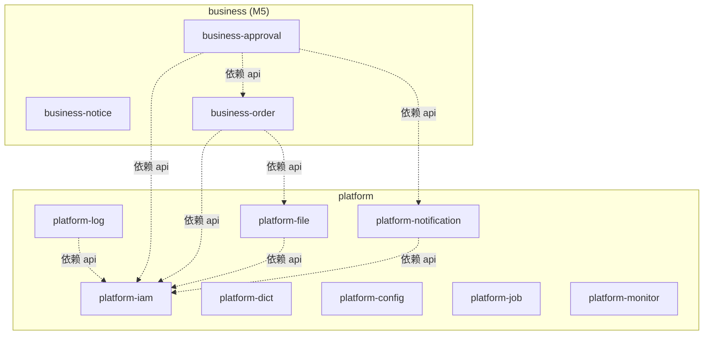

# 01 - 模块结构与边界守护

> **关注点**：6 层 Maven 模块结构、包命名、依赖方向硬约束、模块边界守护机制（Maven pom + ArchUnit 双保险）、跨模块通信（Spring 原生事件）。
>
> **本文件吸收原 backend-architecture.md 的 §1（项目结构）+ §2（模块边界守护）+ §5.2（跨模块走 api 子包反模式修复）**。

## 1. 6 层 Maven 模块 [M1]

### 1.1 决策结论

server 端采用 **6 层 Maven multi-module** 结构，依赖严格单向（ADR-0004）。每一层职责单一，命名空间对称，为 AI 阅读和扩展优化。

### 1.2 6 层 Maven 模块

```
server/
├── mb-common/          # 零 Spring 依赖，纯工具层
├── mb-schema/          # 数据库契约层（Flyway SQL + jOOQ 生成代码）★ ADR-0004 新增
├── mb-infra/           # 基础设施层 (12 个子模块 pom parent)
├── mb-platform/        # 平台业务层 (8 个平台模块 pom parent)
├── mb-business/        # 使用者扩展位 + M5 canonical reference ★ ADR-0004 新增
├── mb-admin/           # Spring Boot 启动入口 + 管理端 HTTP 交付层 + usecase 编排层 + 集成测试 + ArchUnit 测试
└── pom.xml             # 顶层 parent pom，BOM 版本管理
```

**根 pom 关键插件**：
- `flatten-maven-plugin`：CI-friendly `${revision}` 版本号支持。`mvn install` 时将 `${revision}` 替换为实际版本号，确保子模块可被单独运行（如 `spring-boot:run -pl mb-admin`）

**每一层的"存在理由"（拿掉它会怎样）**：

| 层 | 职责 | 拿掉它会怎样 |
|---|------|------------|
| `mb-common` | 零 Spring 工具（异常基类、Snowflake ID、纯函数工具） | 其他层都要重复实现通用工具，或者反向依赖 Spring |
| `mb-schema` | 数据库契约（Flyway SQL + jOOQ 生成代码） | jOOQ 生成代码没地方放，Flyway 和生成代码会跨模块维护 |
| `mb-infra` | 基础设施能力（security/cache/jooq/i18n/async/rate-limit/observability 等） | 每个业务模块都要自己搞基础设施，代码重复爆炸 |
| `mb-platform` | meta-build 官方提供的稳定平台能力（iam/audit/file 等） | 使用者要自己从零实现用户、权限、审计等基础后台功能 |
| `mb-business` | 使用者自己的业务扩展（兼 M5 canonical reference 示例） | 使用者没有"合法"的业务扩展位置，只能污染 platform |
| `mb-admin` | Spring Boot 启动入口，承载管理端 HTTP 入口、管理端特有流程编排（`usecase`）、ArchUnit 测试 | 应用无法启动，管理端特有聚合流程无处安放，架构测试没地方放 |

**依赖方向（单向，不可反转）**：

```
mb-common    ← 零 mb-* 依赖
mb-schema    ← 零 mb-* 依赖（只依赖 org.jooq runtime）
mb-infra     ← 依赖 mb-common
mb-platform  ← 依赖 mb-common + mb-infra + mb-schema
mb-business  ← 依赖 mb-common + mb-infra + mb-schema + mb-platform::api
mb-admin     ← 依赖所有上层模块（聚合启动 + ArchUnit 测试基地）
```

### 1.3 包命名规范

| 层 | 根包 | 示例 |
|---|---|---|
| common | `com.metabuild.common.<功能>` | `com.metabuild.common.exception.MetaBuildException`、`com.metabuild.common.security.CurrentUser`、`com.metabuild.common.security.DataScope` |
| schema | `com.metabuild.schema.<jooq 概念>` | `com.metabuild.schema.tables.MbIamUser` |
| infra | `com.metabuild.infra.<能力>` | `com.metabuild.infra.security.SaTokenCurrentUser`、`com.metabuild.infra.jooq.DataScopeVisitListener` |
| platform | `com.metabuild.platform.<域>.<子包>` | `com.metabuild.platform.iam.domain.user.UserService` |
| business | `com.metabuild.business.<域>.<子包>` | `com.metabuild.business.order.domain.OrderService` |
| admin | `com.metabuild.admin` | `com.metabuild.admin.MetaBuildApplication` |

**关键位置澄清**：`CurrentUser` / `DataScope` / `DataScopeType` / `BypassDataScope` 等**抽象接口和类型定义**在 `mb-common.security`；Sa-Token 相关的**实现类**（`SaTokenCurrentUser` / `SaTokenAuthFacade`）在 `infra-security`；**数据权限的 SQL 注入机制**（`DataScopeRegistry` / `DataScopeVisitListener` / `BypassDataScopeAspect`）在 `infra-jooq`。三层严格分工，见 §5.3 数据权限 opt-out 实现（方案 E）。

### 1.4 server/ 完整目录树

```
server/
├── pom.xml                                   # parent pom + BOM
│
├── mb-common/
│   ├── pom.xml
│   └── src/main/java/com/metabuild/common/
│       ├── exception/                        # MetaBuildException 基类层次
│       ├── id/                               # SnowflakeIdGenerator
│       ├── dto/                              # PageResult 等通用 DTO
│       ├── security/                         # ★ 公共抽象 + 类型定义（ADR-0005 + 方案 E）
│       │   ├── CurrentUser.java              #    认证读门面接口
│       │   ├── CurrentUserInfo.java          #    CurrentUser.snapshot() 的 DTO
│       │   ├── DataScopeType.java            #    数据范围枚举（ALL/CUSTOM_DEPT/OWN_DEPT/OWN_DEPT_AND_CHILD/SELF）
│       │   ├── DataScope.java                #    数据范围值对象（type + deptIds）
│       │   ├── BypassDataScope.java          #    @BypassDataScope 注解
│       │   └── LoginResult.java              #    登录返回值 record
│       ├── constant/                         # 全局常量
│       └── util/                             # 纯工具类（无 Spring 依赖）
│
├── mb-schema/                                # ★ 数据库契约层（ADR-0004）
│   ├── pom.xml                               # 含 jOOQ codegen profile
│   └── src/main/
│       ├── resources/db/migration/           # Flyway SQL 脚本
│       │   ├── V20260601_001__iam_user.sql        # 时间戳命名,ADR-0008
│       │   ├── V20260601_002__iam_role.sql
│       │   ├── V20260602_001__audit_log.sql
│       │   ├── V20260602_002__file_metadata.sql
│       │   ├── V20260603_001__notification.sql
│       │   ├── V20260603_002__dict.sql
│       │   ├── V20260603_003__config.sql
│       │   ├── V20260603_004__job.sql
│       │   ├── V20260603_005__shedlock.sql         # ShedLock 分布式锁表
│       │   ├── V20260603_006__monitor.sql
│       │   └── V20260605_001__init_data.sql
│       └── jooq-generated/                   # jOOQ 生成代码（入 git）
│           └── com/metabuild/schema/
│               ├── tables/                   # 表类型（MbIamUser、MbOperationLog 等）
│               ├── records/                  # Record 类
│               ├── keys/                     # 外键引用
│               └── indexes/                  # 索引引用
│
├── mb-infra/
│   ├── pom.xml                               # parent pom
│   ├── infra-security/                       # Sa-Token 实现：SaTokenCurrentUser + AuthFacade/SaTokenAuthFacade + @RequirePermission + CorsConfig
│   ├── infra-cache/                          # Redis + CacheEvictSupport
│   ├── infra-jooq/                           # JooqHelper + SlowQueryListener + DataScopeRegistry + DataScopeVisitListener + BypassDataScopeAspect（方案 E：数据权限的唯一归属，不含 jOOQ 生成代码）
│   ├── infra-web/                            # 共享 Web 边界（PageRequestDto / PaginationPolicy / MbPaginationProperties）
│   ├── infra-exception/                      # GlobalExceptionHandler + ProblemDetail + SecurityHeaderFilter
│   ├── infra-i18n/                           # MessageSource + LocaleResolver
│   ├── infra-async/                          # AsyncConfig + 线程池 + 上下文传递
│   ├── infra-rate-limit/                     # Bucket4j
│   ├── infra-websocket/                      # v1 留空，v1.5 实施
│   ├── infra-observability/                  # Actuator + Micrometer + Logback JSON
│   ├── infra-archunit/                       # ArchUnit 规则库（规则代码）
│   └── infra-captcha/                        # 滑块验证码
│
├── mb-platform/
│   ├── pom.xml                               # parent pom
│   ├── platform-iam/                         # 用户/角色/菜单/部门/权限/数据范围/会话
│   ├── platform-log/                       # 操作日志
│   ├── platform-file/                        # 文件上传/存储
│   ├── platform-notification/                # 通知/站内信/邮件/短信
│   ├── platform-dict/                        # 字典管理
│   ├── platform-config/                      # 运行时配置
│   ├── platform-job/                         # 定时任务（Spring @Scheduled + ShedLock）
│   └── platform-monitor/                     # 服务器/慢查询监控
│
├── mb-business/                              # ★ 使用者扩展位（ADR-0004）
│   ├── pom.xml                               # parent pom
│   └── (v1 M1-M4: 空目录；M5 填入 canonical reference):
│       ├── business-notice/                  # M5 示例: 低复杂度 CRUD
│       ├── business-order/                   # M5 示例: 主从表 + 状态机
│       └── business-approval/                # M5 示例: 跨模块编排
│
└── mb-admin/
    ├── pom.xml                               # 依赖所有上层模块（聚合启动 + 管理端交付）
    ├── src/main/java/com/metabuild/admin/
    │   ├── MetaBuildApplication.java         # @SpringBootApplication
    │   ├── web/                              # 管理端 HTTP 入口（适配管理端请求/响应）
    │   └── usecase/                          # 管理端特有流程编排（跨模块组合 / 聚合视图）
    ├── src/main/resources/
    │   ├── application.yml                   # 基础配置（含 Sa-Token / HikariCP / Flyway 等）
    │   ├── application-dev.yml
    │   ├── application-prod.yml
    │   ├── application-test.yml
    │   └── logback-spring.xml                # JSON encoder
    └── src/test/java/com/metabuild/
        ├── admin/
        │   ├── BaseIntegrationTest.java      # Testcontainers 单例 + 事务回滚
        │   ├── SharedPostgresContainer.java  # PG 容器单例
        │   └── MetaBuildApplicationTests.java
        ├── TestSecurityConfig.java           # 测试用 @Primary CurrentUser Bean
        ├── MockCurrentUser.java              # 测试用 CurrentUser 实现
        └── architecture/                     # ★ ArchUnit 测试集中地（ADR-0003）
            ├── ArchitectureTest.java         # 所有规则聚合
            ├── JooqIsolationTest.java
            ├── ModuleBoundaryTest.java
            ├── SaTokenIsolationTest.java     # 业务层不依赖 Sa-Token
            └── CacheEvictionTest.java
```

### 1.5 单向依赖硬约束

- `mb-common` **零 mb-\* 依赖**，且不依赖 Spring / jOOQ / JJWT / Sa-Token
- `mb-schema` **零 mb-\* 依赖**，只依赖 `org.jooq` runtime + PostgreSQL 驱动
- `mb-infra` 依赖 `mb-common`，**不依赖** `mb-schema` / `mb-platform` / `mb-business` / `mb-admin`
- `mb-infra` 的 12 个子模块之间**默认互不依赖**（保持职责正交）。所有跨子模块的共享概念（`CurrentUser` / `DataScope` / `LoginResult` 等）**必须放 `mb-common.security` 或 `mb-common.dto`**。方案 E 验证了这一点——原本"需要 infra-jooq 依赖 infra-security"的直觉，靠把公共抽象下沉到 `mb-common` 就能消除
- `mb-platform` 依赖 `mb-common + mb-infra + mb-schema`
- `mb-platform` 子模块之间**禁止直接 Maven 依赖**，跨模块只能通过对方的 `api` 子包（由 Maven pom 白名单 + ArchUnit 规则双保险）
- `mb-business` 依赖 `mb-common + mb-infra + mb-schema + mb-platform::api`（只允许 api 包）
- `mb-admin` 是唯一聚合所有模块的启动入口

<!-- verify: cd server && mvn dependency:tree -pl mb-common | grep -v "INFO\|mb-common" | grep -E "org.springframework|org.jooq|cn.dev33" && echo "FAIL: mb-common 不应依赖 Spring/jOOQ/Sa-Token" || echo "OK" -->

<!-- verify: cd server && mvn dependency:tree -pl mb-schema | grep -v "INFO\|mb-schema" | grep "com.metabuild:mb-" && echo "FAIL: mb-schema 不应依赖其他 mb-* 模块" || echo "OK" -->

<!-- verify: cd server && mvn dependency:tree -pl mb-infra -am | grep -E "com.metabuild:mb-(platform|business|admin)" && echo "FAIL: mb-infra 不应依赖上层" || echo "OK" -->

---

## 2. 模块边界守护机制 [M1+M4]

### 2.1 决策结论

**去掉 Spring Modulith，改用 Maven 依赖隔离 + ArchUnit 规则双保险**（ADR-0003）。理由：
- Modulith 的独特价值（`@ApplicationModuleTest` / `Documenter`）对 meta-build 不是关键需求
- Modulith AI 训练数据少，和"给 AI 执行的契约"北极星冲突
- Modulith 的扁平包结构约束和 meta-build 的分层命名诉求相冲突
- ArchUnit + Maven 能做到 95% 的守护能力，且更 AI 友好

**双保险机制**：
1. **Maven 层（pom 级硬隔离，编译期）**：业务模块之间默认禁止互相依赖，跨模块访问必须在 `pom.xml` 里显式添加依赖声明（pom 层白名单，PR review 时可见）
2. **ArchUnit 层（包级细约束，测试期）**：即使 pom 依赖允许，跨模块仍然只能 `import` 对方的 `api` 子包，禁止 `import domain` 下的内部实现

### 2.2 模块内部包结构（以 iam 为例）

每个业务模块按 `api / domain / web` 三层组织。`api` 子包是对外契约（接口 + DTO），其他子包是内部实现。Repository 放在 `domain/<aggregate>/` 下，不拆独立的 `infrastructure` 包。

```
com.metabuild.platform.iam/
├── api/                           # 对外契约（跨模块唯一允许 import 的子包）
│   ├── UserApi.java               # 接口（interface）
│   ├── RoleApi.java
│   ├── MenuApi.java
│   ├── AuthApi.java
│   ├── vo/                        # 响应契约（record 类型）
│   │   ├── UserVo.java
│   │   └── ...
│   ├── cmd/                       # 写操作契约
│   │   ├── UserCreateCmd.java
│   │   └── ...
│   └── qry/                       # 查询契约
│       ├── UserQry.java
│       └── ...
│
├── domain/                        # 业务逻辑（Service + Repository，不拆 infrastructure）
│   ├── user/
│   │   ├── UserService.java       # implements UserApi
│   │   └── UserRepository.java   # 普通类，零继承；数据权限由 DataScopeVisitListener 在 jOOQ 层自动拦截（方案 E）
│   ├── role/
│   │   ├── RoleService.java
│   │   └── RoleRepository.java
│   ├── menu/
│   │   ├── MenuService.java
│   │   └── MenuRepository.java
│   ├── dept/
│   ├── permission/
│   ├── datascope/
│   ├── auth/
│   └── session/
│
└── web/                           # Controller（依赖本模块 api + domain，以及其他模块的 api）
    ├── UserController.java
    ├── RoleController.java
    └── AuthController.java
```

### 2.3 跨模块访问规则

#### 规则 1：Maven 层 pom 白名单

`platform-log` 的 `pom.xml` 默认只依赖：
```xml
<dependencies>
    <dependency><groupId>com.metabuild</groupId><artifactId>mb-common</artifactId></dependency>
    <dependency><groupId>com.metabuild</groupId><artifactId>mb-schema</artifactId></dependency>
    <!-- infra-* 根据需要 -->
    <dependency><groupId>com.metabuild</groupId><artifactId>infra-security</artifactId></dependency>
    <dependency><groupId>com.metabuild</groupId><artifactId>infra-jooq</artifactId></dependency>
    <dependency><groupId>com.metabuild</groupId><artifactId>infra-cache</artifactId></dependency>
</dependencies>
```

如果 `platform-log` 需要调用 `platform-iam` 的 `UserApi`，必须**显式**在 pom 里添加：
```xml
<dependency><groupId>com.metabuild</groupId><artifactId>platform-iam</artifactId></dependency>
```

这个依赖声明在 PR review 时可见，跨模块依赖关系一目了然。

#### 规则 2：ArchUnit 层只能 import api 子包

即使 `platform-log` 在 pom 里依赖了 `platform-iam`，仍然**只能** `import com.metabuild.platform.iam.api.*`，不能 `import com.metabuild.platform.iam.domain.*`（domain 内部实现，含 Service / Repository）。

ArchUnit 规则会拦截违规：

```java
public static final ArchRule CROSS_PLATFORM_ONLY_VIA_API = classes()
    .that().resideInAPackage("com.metabuild.platform.(*).(domain|web)..")
    .should().onlyDependOnClassesThat()
    .resideInAnyPackage(
        "com.metabuild.platform.${1}..",       // 本模块内部任意访问
        "com.metabuild.platform.*.api..",       // 其他 platform 模块只能访问 api
        "com.metabuild.business.*.api..",       // business 模块 api 也允许
        "com.metabuild.common..",
        "com.metabuild.infra..",
        "com.metabuild.schema..",
        "java..", "jakarta..",
        "org.springframework..", "org.jooq..", "cn.dev33.satoken.." // 技术栈白名单
    );
```

### 2.4 跨模块通信：Spring 原生事件机制

模块间的"**异步通知**"场景（例如 `iam` 创建用户后通知 `audit` 记录日志），用 Spring 原生事件机制：

```java
// iam 模块发布事件
@Service
@RequiredArgsConstructor
public class UserService implements UserApi {
    private final ApplicationEventPublisher events;

    @Transactional
    public User create(UserCreateCmd cmd) {
        User saved = userRepository.save(User.from(cmd));
        events.publishEvent(new UserCreatedEvent(saved.id(), saved.username()));
        return saved;
    }
}

// oplog 模块订阅事件
@Component
public class UserOperationLogListener {
    @Async
    @TransactionalEventListener(phase = TransactionPhase.AFTER_COMMIT)
    public void onUserCreated(UserCreatedEvent event) {
        // 事务提交后异步记录操作日志
        operationLogService.log(event);
    }
}
```

**三个关键注解的组合**：
- `@Async`：异步执行，不阻塞发布者
- `@TransactionalEventListener(phase = AFTER_COMMIT)`：**事务提交后才触发**，避免"事务回滚但通知已发"的不一致
- 事件定义用 Java `record` 放在**发布者模块的 `api` 子包**（订阅者通过 `import iam.api.UserCreatedEvent` 获取）

### 2.5 领域事件命名和版本规范 [P1]

#### 命名约定

`<Aggregate><PastTenseVerb>Event`：
- ✅ `UserCreatedEvent` / `OrderSubmittedEvent` / `PaymentRefundedEvent`
- ❌ `CreateUserEvent`（不是过去时）/ `UserEvent`（没有动词）

#### 字段策略

事件只带 **aggregate ID + 最少必要上下文**，需要详情时订阅者自己查询：

```java
// ✅ 推荐：最小化事件
public record UserCreatedEvent(Long userId, String username, Instant occurredAt) {}

// ❌ 反模式：把整个实体塞进事件
public record UserCreatedEvent(User user) {}
```

**理由**：大事件会让订阅者隐式依赖发布者的内部模型；小事件强制订阅者通过 `UserApi.findById()` 查询，保持边界清晰。

#### 版本策略

- **v1 不做显式事件版本**，字段变更视为 breaking change，要求同时改所有监听者
- 事件类上加注解 `@since` 记录引入版本
- 破坏性变更时：新建 `UserCreatedEventV2`，旧事件打 `@Deprecated`，双发一段时间后删除旧的
- v1.5 如有需要再引入 `spring-modulith-events` 做事件持久化

### 2.6 模块依赖图

手写 mermaid 图作为活文档。每加一个业务模块或改一次跨模块依赖时更新。

**文档位置**：`docs/architecture/module-graph.md`

**M4 完成后的 v1 模块图**（示意）：



### 2.7 M1 启动时的最小实现

M1 只要求：
1. `mb-admin` 的 `pom.xml` 聚合所有子模块
2. `ArchitectureTest` 里有 `CROSS_PLATFORM_ONLY_VIA_API` 规则（即使此时只有 `platform-iam`）
3. 跑 `mvn -pl mb-admin test -Dtest=ArchitectureTest` 通过

M4 阶段每新增一个 platform 模块：
1. 在 `mb-platform/pom.xml` 注册新 module
2. 在 `mb-admin/pom.xml` 添加依赖
3. 跨模块依赖（如 audit → iam）在**自己的** pom 里显式声明
4. ArchUnit 测试自动守护

<!-- verify: cd server && mvn -pl mb-admin test -Dtest=ArchitectureTest -->

---

## 3. 跨模块访问的反模式修复 [M1+M4]

### 3.1 问题

nxboot 里 `RoleService.listForExport()` 直接读 menu 表，通过 `MenuRepository` 查询。`DataScopeAspect` 直接在 Service 层 SQL 中 join `mb_iam_user_role + mb_iam_role` 表。模块边界形同虚设。

### 3.2 修复

**双保险机制（Maven + ArchUnit，ADR-0003 已移除 Spring Modulith）**：

1. **Maven 层 pom 白名单**：`platform-log/pom.xml` 默认不依赖 `platform-iam`。如要用 `UserApi`，必须在 pom 里显式声明依赖（PR review 可见）
2. **ArchUnit 规则**：即使 pom 允许依赖，跨模块仍只能 `import com.metabuild.platform.<X>.api.*`，禁止 import `domain` / `web` 子包
3. **循环依赖检测**：`slices().should().beFreeOfCycles()`

### 3.3 ArchUnit 规则

```java
// mb-infra/infra-archunit/src/main/java/com/metabuild/infra/archunit/rules/ModuleBoundaryRule.java
public class ModuleBoundaryRule {

    /** 跨 platform 模块只能依赖对方的 api 子包 */
    public static final ArchRule CROSS_PLATFORM_ONLY_VIA_API = classes()
        .that().resideInAPackage("com.metabuild.platform.(*).(domain|web)..")
        .should().onlyDependOnClassesThat()
        .resideInAnyPackage(
            "com.metabuild.platform.${1}..",        // 本模块内部任意访问
            "com.metabuild.platform.*.api..",        // 其他 platform 模块只能访问 api
            "com.metabuild.business.*.api..",        // business 模块 api 也允许
            "com.metabuild.common..",
            "com.metabuild.infra..",
            "com.metabuild.schema..",
            "java..", "jakarta..",
            "org.springframework..", "org.jooq..", "cn.dev33.satoken..",
            "lombok..", "org.slf4j..", "com.fasterxml.jackson.."
        )
        .as("跨 platform 模块访问必须通过对方的 api 子包");

    /** business 模块只能依赖 platform 的 api，不能依赖 platform 的 domain 内部实现 */
    public static final ArchRule BUSINESS_ONLY_DEPENDS_ON_PLATFORM_API = noClasses()
        .that().resideInAPackage("com.metabuild.business..")
        .should().dependOnClassesThat()
        .resideInAnyPackage(
            "com.metabuild.platform.*.domain.."
        )
        .as("business 模块只能通过 platform 模块的 api 子包访问其能力");

    /** 循环依赖检测 */
    public static final ArchRule NO_CYCLIC_DEPENDENCIES = slices()
        .matching("com.metabuild.(platform|business).(*)..")
        .should().beFreeOfCycles();
}
```

<!-- verify: cd server && mvn -pl mb-admin test -Dtest=ModuleBoundaryTest -->

---

---

## 4. Domain Model 与层次职责 [M4]

> **关注点**：一个业务实体的完整类清单、Controller/Service/Repository 三层的严格职责划分、包位置约定、典型代码示范。
>
> **核心决策**：基于 jOOQ 官方哲学（反对过度分层）+ Clean Architecture 对权限位置的规范，meta-build 采用**两层架构（Record + DTO）+ 权限在 Controller 层**的设计。

### 4.1 一个业务实体的完整类清单

以"用户"为例，一个业务实体最终有以下文件：

| # | 类名 | 形态 | 来源 | 包位置 | 角色 |
|---|---|---|---|---|---|
| 1 | `mb_iam_user` | Flyway SQL | 手写 | `mb-schema/src/main/resources/db/migration/` | 数据库表 |
| 2 | `MbIamUserRecord` | jOOQ 生成 | codegen | `com.metabuild.schema.tables.records` | **Service 层的数据载体**（不手写）|
| 3 | `UserVo` | record | 手写 | `com.metabuild.platform.iam.api.dto` | API 响应 DTO（脱敏，带 `from(MbIamUserRecord)` 静态工厂）|
| 4 | `UserCreateCmd` | record | 手写 | 同上 | API 创建请求 |
| 5 | `UserUpdateEmailCmd` | record | 手写 | 同上 | API 更新请求（业务动作命名）|
| 6 | `UserQry` | record | 手写 | 同上 | API 查询条件 |
| 7 | `UserCreatedEvent` | record | 手写 | `com.metabuild.platform.iam.api.event` | 领域事件 |
| 8 | `UserApi` | interface | 手写 | `com.metabuild.platform.iam.api` | 跨模块调用接口 |
| 9 | `UserService` | class | 手写 | `com.metabuild.platform.iam.domain.user` | `implements UserApi`，业务编排 |
| 10 | `UserRepository` | class | 手写 | 同上 | 持久化（唯一 import `DSLContext`）|
| 11 | `UserController` | class | 手写 | `com.metabuild.platform.iam.web` | HTTP 入口（`@RequirePermission` 位置）|

**关键说明**：
- **不引入独立 `User` 领域 record**。Service 看到的是 `MbIamUserRecord`（jOOQ 生成）
- 理由：符合 jOOQ 官方"反对过度分层"哲学，避免重复映射层
- 业务不变量通过**数据库约束 + Service 层校验 + ArchUnit** 保证，不是通过独立领域类型

### 4.2 层次职责严格划分

#### Controller 层

> **本质定位**：Controller 是边界适配层（Adapter / Media），不是业务规则归属层。HTTP 只是当前交付协议，将来同样可以有 ws / mqtt / applet 等其他 adapter。

| 职责 | 说明 |
|---|---|
| ✅ 接收 HTTP 请求 | `@RequestBody` / `@PathVariable` / `@RequestParam` / `PageRequestDto`（来自 `infra-web.pagination`） |
| ✅ 参数 bean validation | `@Valid`（Jakarta Bean Validation）|
| ✅ **静态权限检查** | `@RequirePermission("iam.user.create")` 标注方法 |
| ✅ `@OperationLog` 操作日志注解标注 | 推荐放 Controller 层（离 HTTP 入口近）|
| ✅ 调 Service，返回 Vo | 通常一行 `return userService.create(cmd);` |
| ❌ 业务逻辑 | 在 Service 层 |
| ❌ 事务 | 在 Service 层 |
| ❌ 直接 import `DSLContext` / `MbIamUserRecord` | 通过 Service 间接用 |

**补充判断**：

- 模块自身的 `web/`：承载该模块天然拥有的**原子能力接口**（如 CRUD / publish / revoke / enable / disable）
- `mb-admin/web/`：承载**管理端特有接口**，这些接口通常对应 `mb-admin/usecase/` 中的聚合流程

#### Service 层

| 职责 | 说明 |
|---|---|
| ✅ 业务逻辑 | 校验、状态转换、不变量检查 |
| ✅ 事务边界 | `@Transactional`（readOnly=true 用于只读）|
| ✅ 动态权限检查 | `currentUser.hasPermission(String)` 程序性调用（非注解）|
| ✅ 编排多个 Repository / 其他 Service / 跨模块 API | 业务流程的主要发生地 |
| ✅ 事件发布 | `events.publishEvent(new UserCreatedEvent(...))` |
| ✅ import `MbIamUserRecord`（数据类型）| 通过 `mb-schema.*` 包，不是 `org.jooq.*` |
| ❌ import `DSLContext` / `Field` / `Condition` | 由 ArchUnit 强制 |
| ❌ 写 jOOQ DSL 查询 | 查询必须在 Repository 里 |
| ❌ 直接调 `record.store()` / `record.insert()` | 通过 `repository.save(record)` 包装 |
| ❌ `@RequirePermission` 静态权限注解 | 权限在 Controller 层 |

#### `mb-admin/usecase` 层

> **定位**：只存在于 `mb-admin`，用于管理端特有的流程编排和聚合能力。它不是第二套领域层，不拥有原子业务规则。

| 职责 | 说明 |
|---|---|
| ✅ 编排多个模块的原子能力 | 组合 `platform-*` / `business-*` 的 Service / Api |
| ✅ 组织管理端特有流程 | 管理工作台 / 初始化聚合接口 / 批量导入等 |
| ✅ 输出管理端专属聚合视图 | 一个接口返回多个模块拼装结果 |
| ❌ 重新实现模块原子规则 | 不能在这里重写“发布公告”“禁用用户”这类规则 |
| ❌ 变成第二套业务层 | `usecase` 只做 orchestration，不拥有领域归属 |

**命名约束**：

- `mb-admin` 中这一层统一命名为 `usecase`
- 不用 `business`，避免和顶层 `mb-business` 语义冲突

**判断标准**：

- 单模块即可闭环、未来多端可能复用的能力 → 放模块自身 `web/ + domain/`
- 管理端专属、需要跨模块组合、返回聚合视图的能力 → 放 `mb-admin/usecase/ + web/`

#### Repository 层

| 职责 | 说明 |
|---|---|
| ✅ **唯一** import `DSLContext` 的地方 | 写 jOOQ DSL 查询（ArchUnit 规则 `DSLCONTEXT_ONLY_IN_REPOSITORY` 强制，见 [08-archunit-rules.md §6](08-archunit-rules.md)）|
| ✅ 提供 `findById` / `findByUsername` / `page` / `count` / `exists` 等检索方法 | 业务性命名 |
| ✅ 提供 `save(Record)` / `delete(Record)` 等保存方法 | 内部调 `record.store()` / `.delete()`（M4.2 原生路径）|
| ✅ 提供 `newRecord()` 包装 `dsl.newRecord(TABLE)` | Service 不直接用 dsl |
| ✅ 批量/条件操作通过 `JooqHelper` | M4.2 二元路径的批量侧 |
| ❌ `@Transactional` | 事务在 Service 层定义 |
| ❌ 抛 `BusinessException` | Repository 返回 Optional / 空列表，Service 判断是否抛业务异常 |
| ❌ 调 `CurrentUser` / 做权限判断 | Repository 是纯持久化 |
| ❌ 发事件 | 事件在 Service 层发布 |
| ❌ 调其他 Repository | Repository 之间不互相调用，编排在 Service |

### 4.3 包结构约定

```
platform-iam/
├── api/                              # 对外 API 边界
│   ├── UserApi.java                  # 跨模块调用接口
│   ├── RoleApi.java
│   ├── vo/                           # 响应契约
│   │   ├── UserVo.java
│   │   └── ...
│   ├── cmd/                          # 写操作契约
│   │   ├── UserCreateCmd.java
│   │   ├── UserUpdateEmailCmd.java
│   │   └── ...
│   ├── qry/                          # 查询契约
│   │   ├── UserQry.java
│   │   └── ...
│   └── event/                        # 领域事件
│       ├── UserCreatedEvent.java
│       ├── UserDeletedEvent.java
│       └── ...
├── domain/                           # 业务逻辑（Service + Repository 不拆 infrastructure）
│   ├── user/
│   │   ├── UserService.java          # implements UserApi
│   │   └── UserRepository.java       # 普通 class
│   ├── role/
│   │   └── ...
│   └── auth/
│       └── AuthService.java
└── web/                              # HTTP 入口
    ├── UserController.java
    └── RoleController.java

mb-admin/
├── web/                              # 管理端 HTTP 入口（适配管理端请求/响应）
│   ├── DashboardController.java
│   └── UserWorkspaceController.java
└── usecase/                          # 管理端特有流程编排
    ├── DashboardUseCase.java
    └── UserWorkspaceUseCase.java
```

**关键约定**：
- **不拆 `domain / infrastructure` 两层**（不过度分层）
- `Repository` 作为普通 class 放在 `domain/<aggregate>/` 下
- 跨模块调用通过 `api/<Module>Api.java` 接口（`CROSS_PLATFORM_ONLY_VIA_API` ArchUnit 规则强制）
- `mb-admin/usecase/` 只做管理端特有流程编排，不拥有原子业务规则

### 4.4 典型 Repository 代码

```java
// platform-iam/domain/user/UserRepository.java
package com.metabuild.platform.iam.domain.user;

import com.metabuild.common.dto.PageQuery;
import com.metabuild.common.dto.PageResult;
import com.metabuild.infra.jooq.query.SortParser;
import com.metabuild.platform.iam.api.dto.UserQry;
import com.metabuild.platform.iam.api.dto.UserVo;
import com.metabuild.schema.tables.records.MbIamUserRecord;
import lombok.RequiredArgsConstructor;
import org.jooq.Condition;
import org.jooq.DSLContext;              // ← Repository 是唯一允许 import 这些的地方
import org.jooq.SortField;
import org.jooq.impl.DSL;
import org.springframework.stereotype.Repository;

import java.util.List;
import java.util.Optional;

import static com.metabuild.schema.tables.MbIamUser.MB_IAM_USER;

@Repository
@RequiredArgsConstructor
public class UserRepository {

    private final DSLContext dsl;

    // ---------- 查询 ----------

    public Optional<MbIamUserRecord> findById(Long id) {
        return Optional.ofNullable(dsl.fetchOne(MB_IAM_USER, MB_IAM_USER.ID.eq(id)));
    }

    public Optional<MbIamUserRecord> findByUsername(String username) {
        return Optional.ofNullable(dsl.fetchOne(MB_IAM_USER, MB_IAM_USER.USERNAME.eq(username)));
    }

    public boolean existsByUsername(String username) {
        return dsl.fetchExists(MB_IAM_USER, MB_IAM_USER.USERNAME.eq(username));
    }

    public PageResult<UserVo> page(UserQry query, PageQuery pagination) {
        List<SortField<?>> orderBy = SortParser.builder()
            .forTable(MB_IAM_USER)
            .allow("username", MB_IAM_USER.USERNAME)
            .allow("email",    MB_IAM_USER.EMAIL)
            .defaultSort(MB_IAM_USER.CREATED_AT.desc())
            .parse(pagination.sort());

        Condition where = buildCondition(query);

        long total = dsl.selectCount().from(MB_IAM_USER).where(where).fetchOne(0, long.class);
        List<MbIamUserRecord> records = dsl.selectFrom(MB_IAM_USER)
            .where(where)
            .orderBy(orderBy)
            .limit(pagination.size())
            .offset(pagination.offset())
            .fetch();

        return PageResult.of(
            records.stream().map(UserVo::from).toList(),
            total,
            pagination
        );
    }

    private Condition buildCondition(UserQry query) {
        Condition c = DSL.trueCondition();
        if (query.usernameLike() != null) {
            c = c.and(MB_IAM_USER.USERNAME.likeIgnoreCase("%" + query.usernameLike() + "%"));
        }
        if (query.status() != null) {
            c = c.and(MB_IAM_USER.STATUS.eq(query.status()));
        }
        return c;
    }

    // ---------- 构造 / 保存 / 删除 ----------

    public MbIamUserRecord newRecord() {
        return dsl.newRecord(MB_IAM_USER);
    }

    /**
     * 保存（插入或更新）。内部走 M4.2 原生路径，自动触发 Settings + RecordListener.
     */
    public MbIamUserRecord save(MbIamUserRecord record) {
        record.store();  // 新记录 INSERT，已有 UPDATE + 乐观锁
        return record;
    }

    public int delete(MbIamUserRecord record) {
        return record.delete();
    }
}
```

### 4.5 典型 Service 代码

```java
// platform-iam/domain/user/UserService.java
package com.metabuild.platform.iam.domain.user;

import com.metabuild.common.exception.BusinessException;
import com.metabuild.common.exception.NotFoundException;
import com.metabuild.common.security.CurrentUser;
import com.metabuild.platform.iam.api.UserApi;
import com.metabuild.platform.iam.api.dto.*;
import com.metabuild.platform.iam.api.event.UserCreatedEvent;
import com.metabuild.schema.tables.records.MbIamUserRecord;  // ← 数据类型，不是 org.jooq.*
import lombok.RequiredArgsConstructor;
import org.springframework.context.ApplicationEventPublisher;
import org.springframework.security.crypto.password.PasswordEncoder;
import org.springframework.stereotype.Service;
import org.springframework.transaction.annotation.Transactional;

@Service
@RequiredArgsConstructor
public class UserService implements UserApi {

    private final UserRepository userRepository;   // ← 通过 Repository 访问数据
    // 注意：没有 DSLContext dsl
    private final PasswordEncoder passwordEncoder;
    private final CurrentUser currentUser;
    private final ApplicationEventPublisher events;

    @Transactional
    public UserVo create(UserCreateCmd cmd) {
        // 业务校验
        if (userRepository.existsByUsername(cmd.username())) {
            throw new BusinessException("iam.user.usernameExists", cmd.username());
        }

        // 通过 Repository 构造 Record（不直接用 DSLContext）
        MbIamUserRecord record = userRepository.newRecord();
        record.setUsername(cmd.username());
        record.setEmail(cmd.email());
        record.setPasswordHash(passwordEncoder.encode(cmd.password()));
        record.setStatus(1);

        // 通过 Repository 保存
        MbIamUserRecord saved = userRepository.save(record);

        // 发事件
        events.publishEvent(new UserCreatedEvent(saved.getId(), currentUser.userId()));

        return UserVo.from(saved);
    }

    @Transactional
    public UserVo updateEmail(Long userId, UserUpdateEmailCmd cmd) {
        MbIamUserRecord record = userRepository.findById(userId)
            .orElseThrow(() -> new NotFoundException("iam.user.notFound"));

        // 动态权限（不是注解）：只能改自己的邮箱，或有 update 权限
        if (!currentUser.userId().equals(userId) && !currentUser.hasPermission("iam.user.update")) {
            throw new BusinessException("iam.user.cannotUpdate");
        }

        record.setEmail(cmd.newEmail());
        MbIamUserRecord saved = userRepository.save(record);
        return UserVo.from(saved);
    }

    @Transactional(readOnly = true)
    public PageResult<UserVo> page(UserQry query, PageQuery pagination) {
        return userRepository.page(query, pagination);
    }
}
```

### 4.6 典型 Controller 代码

```java
// platform-iam/web/UserController.java
package com.metabuild.platform.iam.web;

import com.metabuild.common.dto.PageQuery;
import com.metabuild.common.dto.PageResult;
import com.metabuild.infra.security.RequirePermission;
import com.metabuild.platform.operationlog.OperationLog;
import com.metabuild.platform.iam.api.dto.*;
import com.metabuild.platform.iam.domain.user.UserService;
import jakarta.validation.Valid;
import lombok.RequiredArgsConstructor;
import org.springframework.web.bind.annotation.*;

@RestController
@RequestMapping("/api/v1/admin/iam/users")
@RequiredArgsConstructor
public class UserController {

    private final UserService userService;

    @PostMapping
    @RequirePermission("iam.user.create")                // ← 权限在 Controller 层
    @OperationLog(action = "iam.user.create", targetType = "User", targetIdExpr = "#result.id")
    public UserVo create(@RequestBody @Valid UserCreateCmd cmd) {
        return userService.create(cmd);
    }

    @PatchMapping("/{id}/email")
    @RequirePermission("iam.user.update")
    @OperationLog(action = "iam.user.updateEmail", targetType = "User", targetIdExpr = "#id")
    public UserVo updateEmail(@PathVariable Long id, @RequestBody @Valid UserUpdateEmailCmd cmd) {
        return userService.updateEmail(id, cmd);
    }

    @GetMapping
    @RequirePermission("iam.user.view")
    public PageResult<UserVo> list(UserQry query, PageQuery pagination) {
        return userService.page(query, pagination);
    }
}
```

### 4.7 Service 膨胀怎么办：编排 Service 拆分

当业务涉及**跨多个聚合根 / 跨多个模块 / 多步流程**时，拆出独立的"编排 Service"：

| 业务场景 | 基础 Service | 编排 Service |
|---|---|---|
| 单一聚合 CRUD | `UserService` / `OrderService` | — |
| 用户注册流程 | — | `UserRegistrationService`（编排 UserService + MailService + OperationLogService）|
| 订单提交流程 | — | `OrderSubmitService`（编排 OrderService + InventoryService + NotificationService）|
| 审批流程 | — | `ApprovalFlowService`（编排多个 platform-iam + business 模块）|

**拆分信号**：
- Service 超过 500 行
- Service 依赖注入超过 8 个
- 一个方法跨越 3 个以上模块

**命名约定**：
- 单一聚合 → `<Aggregate>Service`（如 `UserService`）
- 流程编排 → `<Process>Service`（如 `UserRegistrationService`）

**位置**：

- **模块内复杂编排**：仍放同模块 `domain/` 包（不强制再拆 `application/`）
- **管理端特有跨模块编排**：放 `mb-admin/usecase/`

**不强制区分 DDD 经典的 "Application Service vs Domain Service"**——meta-build 只区分“能力归属在哪一层”：

- 原子能力归模块自身
- 管理端特有聚合流程归 `mb-admin/usecase`

M5 canonical reference `business-approval` 仍是模块内编排 Service 的示范样本；未来 dashboard / workspace 等管理端聚合能力则归 `mb-admin/usecase`。

### 4.8 DTO 命名后缀约定

| 后缀 | 角色 | 例子 |
|---|---|---|
| `*Record` | jOOQ 生成的数据行（不手写）| `MbIamUserRecord` / `BizOrderMainRecord` |
| `*Vo` | API 响应 DTO | `UserVo` / `OrderDetailVo` |
| `*Cmd` | 写操作请求（Create/Update/Delete/业务动作）| `UserCreateCmd` / `UserUpdateEmailCmd` / `OrderSubmitCmd` / `UserLockCmd` |
| `*Qry` | 读操作查询参数 | `UserQry` / `OrderQry` |
| `*Event` | 领域事件 | `UserCreatedEvent` / `OrderSubmittedEvent` |
| `*Api` | 跨模块调用接口 | `UserApi` / `OrderApi` |
| `*Service` | 模块内业务服务 class | `UserService implements UserApi` |
| `*Repository` | 持久化 class | `UserRepository` |
| `*Controller` | HTTP 入口 | `UserController` |


[← 返回 README](./README.md)
