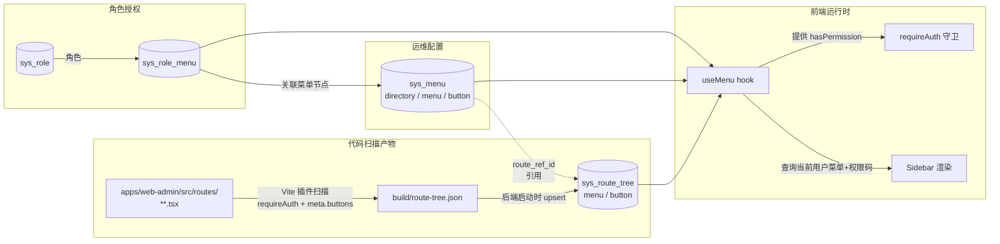

# 07 - 菜单与权限双树架构

> **关注点**：菜单/路由/权限的双树架构 + 路由树 `sys_route_tree` + 菜单树 `sys_menu` + 权限一致性 + 孤儿处理 + 菜单管理 UI + 前后端 code 共享清单。
>
> **本文件吸收**：brainstorming 决策"菜单 / 路由 / 权限双树架构"（决策 5）+ 千人千面 MUST #3（路由必须声明权限）+ MUST #6（数据库存储的文案永不走 i18n）+ project memory `project_frontend_permission_dual_tree.md`。
>
> **关键交叉引用**：[../backend/05-security.md](../backend/05-security.md)（后端 `@RequirePermission` + `CurrentUser` 门面）+ [../backend/04-data-persistence.md](../backend/04-data-persistence.md)（SQL 表结构规范）+ [06-routing-and-data.md](./06-routing-and-data.md)（前端路由守卫 `requireAuth`）。

---

## 1. 决策结论 [M3+M4]

### 1.1 双树架构总览

meta-build 的菜单/权限体系采用 **路由树 + 菜单树双树架构**——把"代码反映出来的可访问范围"和"运维组织出来的呈现形式"作为两个独立的关注点物理隔离：

| 树 | 表名 | 来源 | 写入者 | 读取者 | 结构 |
|---|------|------|--------|--------|------|
| **路由树** | `sys_route_tree` | 前端代码扫描产物 | 后端启动时 upsert（自动）| 运维只读、菜单管理时被引用 | 两级（`menu` → `button`） |
| **菜单树** | `sys_menu` | 运维手动配置 | 运维通过菜单管理 UI | 前端 `useMenu()` 渲染侧边栏 | 任意嵌套（`directory` / `menu` / `button` 节点） |

**关联**：`sys_role_menu` 只关联到菜单节点；权限检查时通过 `sys_menu.route_ref_id` JOIN 到 `sys_route_tree.code` 拿到最终权限点清单。

### 1.2 决策依据（一句话）

代码结构（路由树）和业务组织（菜单树）是两个独立的演化轴，**单表方案是把这两个职责强行揉在一起，看似简单实则违反单一职责原则**。两棵独立的树才是真正的解耦——技术关注点和业务关注点物理隔离。

### 1.3 milestone 分布

| 阶段 | 内容 |
|------|------|
| `[M3]` | 前端 Vite 扫描插件 + `route-tree.json` 生成 + `useMenu()` hook + 菜单管理 UI 的 L5 features |
| `[M4]` | 后端 `sys_route_tree` / `sys_menu` / `sys_role_menu` 表 + 启动时 upsert 同步 + `MenuApi` Controller |
| `[M3+M4]` | 前后端联调（菜单管理 UI + 孤儿灰化 + 权限点 CI 校验） |

---

## 2. 单表方案的否决（brainstorming 的教训）

### 2.1 nxboot `sys_menu` 单表设计的回顾

nxboot 把所有权限相关的概念塞进一张 `sys_menu` 表，靠 `type` 字段区分：

```sql
-- nxboot 反面教材：单表混合三种概念
CREATE TABLE sys_menu (
    id          BIGINT PRIMARY KEY,
    parent_id   BIGINT,
    type        SMALLINT,    -- 1=directory 2=menu 3=button
    name        VARCHAR(64),
    path        VARCHAR(128),
    component   VARCHAR(128),
    icon        VARCHAR(64),
    permission  VARCHAR(128),
    sort        INT
);
```

这张表同时承担四个角色：

1. **代码权限点的清单**（`type=button` 行的 `permission` 字段）
2. **页面路由的注册表**（`type=menu` 行的 `path` + `component`）
3. **运维定义的菜单层次**（`parent_id` 关系）
4. **运维自定义的显示名/图标/排序**

### 2.2 单一职责原则的过度泛化

第一个本能反应是"按单一职责拆"——把 `sys_menu` 拆成 `sys_permission`（权限点）+ `sys_menu`（菜单）两张表。但这同样不对：

| 拆分方案 | 问题 |
|---------|------|
| `sys_permission` + `sys_menu` 两张独立表 | 权限点和菜单仍然各自维护，**仍然有 drift 风险**（代码改了权限点，要手动同步两张表） |
| 把所有 button 行抽到 `sys_permission`，menu 行留在 `sys_menu` | 两个表的 `parent_id` 互相引用形成"伪一棵树"，更难维护 |

**单一职责原则被过度泛化的征兆**：把"本来是一个概念"的东西硬拆成两张表（伪解耦），或者把"本来是两个概念"的东西塞进一张表靠 `type` 区分（伪聚合）。两种都是反模式。

### 2.3 第一性原理推导出的双树

退回到第一性原理重新问：**这里到底有几个独立的演化轴？**

| 轴 | 谁在改 | 改的频率 | 改的对象 |
|---|--------|---------|---------|
| 代码结构 | 开发者写代码 | 高 | 路由文件 + `requireAuth` 声明 |
| 业务组织 | 运维/产品 | 中 | 菜单的层次 + 显示名 + 图标 + 排序 |
| 角色授权 | 管理员 | 低 | 角色与菜单节点的关联 |

**结论**：代码结构和业务组织是两个独立演化轴，必须物理隔离成两棵独立的树。这不是"违反单一职责"，而是**真正落实单一职责**——每张表只为一个演化轴负责。

| 单表 / 伪拆分 | 双树 |
|--------------|------|
| 代码改 → 同步表 → drift 风险 | 代码改 → 启动时 upsert → 自动同步（**通过引用关系天然一致**） |
| 运维改菜单层次会污染权限点 | 运维只能改 `sys_menu`，`sys_route_tree` 只读 |
| 权限点和菜单层次互相阻塞 | 两张表各自演化 |
| 同步靠 CI 脚本（工程补丁） | 同步靠引用关系（架构解决） |

---

## 3. 双树架构总览



**核心要点**：

- **路由树是代码反映**：`sys_route_tree` 的内容由前端代码 `routes/**/*.tsx` 决定，运维只读
- **菜单树是运维资产**：`sys_menu` 的内容由运维通过菜单管理 UI 决定，可任意嵌套
- **关联是引用而不是冗余**：`sys_menu.route_ref_id` 指向 `sys_route_tree.id`，`sys_role_menu` 只关联菜单节点；最终权限点通过 JOIN 推导，**任何一处改动不需要同步另一处**
- **孤儿降级而非崩溃**：路由树节点被代码删除时标记为 stale（`is_stale=true`），菜单管理 UI 灰化对应节点 + 提示重新绑定，运行时 `useMenu()` 过滤掉灰化节点

---

## 4. 路由树 sys_route_tree [M3+M4]

### 4.1 表结构

完整 SQL DDL（对齐 [../backend/04-data-persistence.md §1](../backend/04-data-persistence.md) 的命名规范 + 审计字段）：

```sql
-- mb-schema/src/main/resources/db/migration/V20260801_001__iam_route_tree.sql
CREATE TABLE sys_iam_route_tree (
    id              BIGINT       PRIMARY KEY,
    tenant_id       BIGINT       NOT NULL DEFAULT 0,
    kind            VARCHAR(16)  NOT NULL,         -- 'menu' | 'button'
    code            VARCHAR(128) NOT NULL,         -- 权限点：'iam.user.list' / 'order.delete'
    default_name    VARCHAR(128) NOT NULL,         -- 代码里声明的默认显示名（不走 i18n）
    path            VARCHAR(256),                  -- menu 节点的路由路径；button 节点为 NULL
    parent_code     VARCHAR(128),                  -- button 归属的 menu 的 code；menu 节点为 NULL
    description     VARCHAR(256),                  -- 代码注释提取，运维参考用
    is_stale        BOOLEAN      NOT NULL DEFAULT FALSE,  -- stale 标记 fallback（代码侧已不再出现）
    last_seen_at    TIMESTAMP WITH TIME ZONE NOT NULL,    -- 最近一次扫描看到本节点的时间
    version         INT          NOT NULL DEFAULT 0,
    created_by      BIGINT,
    created_at      TIMESTAMP WITH TIME ZONE NOT NULL DEFAULT CURRENT_TIMESTAMP,
    updated_by      BIGINT,
    updated_at      TIMESTAMP WITH TIME ZONE NOT NULL DEFAULT CURRENT_TIMESTAMP
);

CREATE UNIQUE INDEX uk_sys_iam_route_tree_tenant_code
    ON sys_iam_route_tree (tenant_id, code);

CREATE INDEX idx_sys_iam_route_tree_parent
    ON sys_iam_route_tree (tenant_id, parent_code)
    WHERE is_stale = FALSE;
```

字段说明：

| 字段 | 含义 | 来源 |
|------|------|------|
| `kind` | `'menu'`（页面）或 `'button'`（按钮权限） | 扫描时根据是 `requireAuth` 还是 `meta.buttons[]` 判断 |
| `code` | 权限点字符串，对应前端 `requireAuth({ permission })` + 后端 `@RequirePermission` | 代码里显式声明 |
| `default_name` | 代码里声明的默认名（运维通常会在 `sys_menu` 里覆盖） | 路由文件的 `meta.title` 或 `meta.buttons[].label` |
| `path` | 路由路径（仅 menu 有） | 路由文件的 file-based path（TanStack Router 推导） |
| `parent_code` | button 归属的 menu code（menu 节点为 NULL） | `meta.buttons[]` 所在路由的 `requireAuth.permission` |
| `description` | 节点描述，给运维 picker 用 | 路由文件 `meta.description` 或紧邻的 JSDoc 注释 |
| `is_stale` | 代码侧已不再出现的标记（非运维 DELETE 动作） | 启动时同步逻辑：本次扫描未出现某 code 时置为 `TRUE`；代码加回来会自动复位为 `FALSE` |
| `last_seen_at` | 最近一次启动扫描看到本节点的时间戳 | 启动时 upsert 设置为当前时间 |

**为什么叫 `is_stale`**：

语义明确区分。`is_stale` 表示"代码侧已不再出现"——是**代码演化过程中的自然状态**（开发者删了 `routes/orders/index.tsx`），而不是运维的 DELETE 动作。这个状态不是终态：如果代码把路由加回来，`RouteTreeSyncRunner` 会在下次启动时把该节点的 `is_stale` 复位为 `false`（见 §4.3 upsert 表）。

本表**没有**通用 DELETE 标记列——M4.2 后端已去除全表通用 `deleted` 位，代码删了路由就是物理 DELETE，这里用 `is_stale` 作为"代码演化"语义的 fallback，与运维 DELETE 语义彻底解耦。

### 4.2 生成机制：前端 Vite 插件扫描 routes

`apps/web-admin/src/routes/**/*.tsx` 是路由源——每个文件用 `createFileRoute(...)` 声明，`requireAuth({ permission })` 在 `beforeLoad` 里使用，`meta.buttons[]` 在路由 meta 里声明：

```tsx
// apps/web-admin/src/routes/orders/index.tsx
import { createFileRoute } from '@tanstack/react-router';
import { requireAuth } from '@mb/app-shell/auth/require-auth';
import { OrderListPage } from '@/features/orders/list-page';

export const Route = createFileRoute('/orders/')({
  beforeLoad: requireAuth({ permission: 'order.read' }),
  component: OrderListPage,
  meta: () => ({
    title: '订单列表',
    description: '订单管理主列表页',
    buttons: [
      { permission: 'order.create', label: '新建订单' },
      { permission: 'order.delete', label: '删除订单' },
      { permission: 'order.export', label: '导出订单' }
    ]
  })
});
```

Vite 插件 `vite-plugin-route-tree` 在构建时遍历这些文件，AST 解析 `requireAuth` + `meta.buttons` 的字面量参数，输出 `client/apps/web-admin/build/route-tree.json`：

```ts
// client/tools/vite-plugin-route-tree/src/index.ts
import type { Plugin } from 'vite';
import { promises as fs } from 'node:fs';
import path from 'node:path';
import fg from 'fast-glob';
import { parse } from '@babel/parser';
import traverse from '@babel/traverse';

export interface RouteTreeNode {
  kind: 'menu' | 'button';
  code: string;
  defaultName: string;
  path: string | null;
  parentCode: string | null;
  description: string | null;
}

export interface RouteTreePluginOptions {
  routesDir: string;        // 例：'src/routes'
  outputFile: string;       // 例：'build/route-tree.json'
}

export function vitePluginRouteTree(options: RouteTreePluginOptions): Plugin {
  return {
    name: 'mb:route-tree',
    apply: 'build',
    async closeBundle() {
      const files = await fg('**/*.tsx', { cwd: options.routesDir, absolute: true });
      const nodes: RouteTreeNode[] = [];
      for (const file of files) {
        const content = await fs.readFile(file, 'utf-8');
        const ast = parse(content, {
          sourceType: 'module',
          plugins: ['typescript', 'jsx']
        });
        const extracted = extractFromAst(ast, file, options.routesDir);
        nodes.push(...extracted);
      }
      const outputPath = path.resolve(options.outputFile);
      await fs.mkdir(path.dirname(outputPath), { recursive: true });
      await fs.writeFile(outputPath, JSON.stringify({ nodes }, null, 2), 'utf-8');
    }
  };
}

function extractFromAst(ast: ReturnType<typeof parse>, file: string, routesDir: string): RouteTreeNode[] {
  const result: RouteTreeNode[] = [];
  let menuPermission: string | null = null;
  let menuTitle: string | null = null;
  let menuDescription: string | null = null;
  const buttons: Array<{ permission: string; label: string }> = [];

  traverse(ast, {
    CallExpression(callPath) {
      const callee = callPath.node.callee;
      if (callee.type === 'Identifier' && callee.name === 'requireAuth') {
        const arg = callPath.node.arguments[0];
        if (arg && arg.type === 'ObjectExpression') {
          for (const prop of arg.properties) {
            if (
              prop.type === 'ObjectProperty' &&
              prop.key.type === 'Identifier' &&
              prop.key.name === 'permission' &&
              prop.value.type === 'StringLiteral'
            ) {
              menuPermission = prop.value.value;
            }
          }
        }
      }
    }
    // ... 类似地解析 meta 函数体里的 title / description / buttons
  });

  if (menuPermission != null) {
    const routePath = derivePathFromFile(file, routesDir);
    result.push({
      kind: 'menu',
      code: menuPermission,
      defaultName: menuTitle ?? menuPermission,
      path: routePath,
      parentCode: null,
      description: menuDescription
    });
    for (const btn of buttons) {
      result.push({
        kind: 'button',
        code: btn.permission,
        defaultName: btn.label,
        path: null,
        parentCode: menuPermission,
        description: null
      });
    }
  }
  return result;
}

function derivePathFromFile(file: string, routesDir: string): string {
  const rel = path.relative(routesDir, file).replace(/\\/g, '/');
  return '/' + rel
    .replace(/\.tsx$/, '')
    .replace(/\/index$/, '')
    .replace(/\$([a-zA-Z0-9_]+)/g, ':$1');
}
```

`route-tree.json` 是构建产物，**入 git** 以便后端启动时直接读取：

```json
{
  "nodes": [
    {
      "kind": "menu",
      "code": "order.read",
      "defaultName": "订单列表",
      "path": "/orders",
      "parentCode": null,
      "description": "订单管理主列表页"
    },
    {
      "kind": "button",
      "code": "order.create",
      "defaultName": "新建订单",
      "path": null,
      "parentCode": "order.read",
      "description": null
    },
    {
      "kind": "button",
      "code": "order.delete",
      "defaultName": "删除订单",
      "path": null,
      "parentCode": "order.read",
      "description": null
    }
  ]
}
```

### 4.3 后端启动时 upsert 同步逻辑

后端 `mb-platform/platform-iam` 启动时通过 `RouteTreeSyncRunner` 读取 `route-tree.json` 并 upsert 到 `sys_iam_route_tree`：

```java
// mb-platform/platform-iam/.../infrastructure/RouteTreeSyncRunner.java
@Component
@RequiredArgsConstructor
public class RouteTreeSyncRunner implements ApplicationRunner {

    private final RouteTreeRepository routeTreeRepository;
    private final ObjectMapper objectMapper;

    @Value("${mb.route-tree.path:classpath:route-tree.json}")
    private Resource routeTreeResource;

    @Override
    @Transactional
    public void run(ApplicationArguments args) throws Exception {
        if (!routeTreeResource.exists()) {
            log.warn("route-tree.json not found, skipping sys_iam_route_tree sync");
            return;
        }
        RouteTreeFile file;
        try (InputStream in = routeTreeResource.getInputStream()) {
            file = objectMapper.readValue(in, RouteTreeFile.class);
        }
        Instant now = Instant.now();
        Set<String> seenCodes = new HashSet<>();
        for (RouteTreeNodeDto node : file.nodes()) {
            routeTreeRepository.upsertByCode(node, now);
            seenCodes.add(node.code());
        }
        // stale 标记 fallback：本次扫描没看到的节点标记 is_stale=true
        routeTreeRepository.markStaleAsDeleted(seenCodes, now);
    }
}
```

**upsert 行为**：

| 情况 | 行为 |
|------|------|
| 数据库不存在该 `code` | 插入新行，`last_seen_at = now`，`is_stale = false` |
| 数据库已有该 `code`，`is_stale = false` | 更新 `default_name` / `path` / `parent_code` / `description` / `last_seen_at = now` |
| 数据库已有该 `code`，`is_stale = true`（之前被代码删过又加回来） | 复活：`is_stale = false`，更新所有字段，`last_seen_at = now` |
| 数据库已有，但本次扫描没出现 | `markStaleAsDeleted` 把它标记为 `is_stale = true` |

### 4.4 stale 标记 fallback

- **不物理删除**：避免菜单管理 UI 出现"引用 NULL"导致前端崩溃
- **菜单 UI 灰化**：菜单管理页面看到 `route_ref_id` 指向 `is_stale=true` 的节点时，灰化该菜单项 + 显示 tooltip "原路由 X 已删除，请重新绑定或移除"
- **运行时过滤**：`MenuApi.queryUserMenu()` 在返回前过滤掉 `is_stale=true` 的节点（运维即使忘了清理，普通用户也不会看到孤儿菜单）

<!-- verify: cd client && pnpm -F web-admin build && test -f apps/web-admin/build/route-tree.json -->

---

## 5. 菜单树 sys_menu [M3+M4]

### 5.1 表结构

```sql
-- mb-schema/src/main/resources/db/migration/V20260801_002__iam_menu.sql
CREATE TABLE sys_iam_menu (
    id              BIGINT       PRIMARY KEY,
    tenant_id       BIGINT       NOT NULL DEFAULT 0,
    parent_id       BIGINT,                       -- 菜单树自己的父子关系，和路由树无关
    route_ref_id    BIGINT,                       -- 引用 sys_iam_route_tree.id；directory 节点为 NULL
    kind            VARCHAR(16)  NOT NULL,        -- 'directory' | 'menu' | 'button'（冗余便于查询）
    name            VARCHAR(128) NOT NULL,        -- 普通 VARCHAR，数据库数据不走 i18n（MUST #6）
    icon            VARCHAR(256),                 -- lucide 图标 key 或 http(s) URL
    sort_order      INT          NOT NULL DEFAULT 0,
    visible         BOOLEAN      NOT NULL DEFAULT TRUE,
    version         INT          NOT NULL DEFAULT 0,
    created_by      BIGINT,
    created_at      TIMESTAMP WITH TIME ZONE NOT NULL DEFAULT CURRENT_TIMESTAMP,
    updated_by      BIGINT,
    updated_at      TIMESTAMP WITH TIME ZONE NOT NULL DEFAULT CURRENT_TIMESTAMP
);

CREATE INDEX idx_sys_iam_menu_tenant_parent
    ON sys_iam_menu (tenant_id, parent_id);

CREATE INDEX idx_sys_iam_menu_tenant_route_ref
    ON sys_iam_menu (tenant_id, route_ref_id);
```

### 5.2 任意嵌套 + route_ref_id 引用

**关键不变量**：

| 节点类型 | `route_ref_id` | `parent_id` | 含义 |
|---------|---------------|-------------|------|
| `directory` | NULL | 任意（顶层为 NULL） | 仅作分组容器，不对应任何路由 |
| `menu` | 引用 `sys_iam_route_tree.id`（且对应 `kind='menu'`） | 任意 | 对应一个页面入口 |
| `button` | 引用 `sys_iam_route_tree.id`（且对应 `kind='button'`） | 必须是某个 menu 节点 | 不在侧边栏渲染，仅参与权限判断 |

**任意嵌套的体现**：运维可以把"订单管理"菜单从"配置中心"目录调到"客户管理"目录下，只需改一行 `parent_id`：

```sql
-- 把订单管理菜单从"配置中心"调到"客户管理"
UPDATE sys_iam_menu
SET parent_id = (SELECT id FROM sys_iam_menu WHERE name = '客户管理'),
    sort_order = 0
WHERE id = 12345;
```

这个改动**不影响**：
- 路由树（`sys_iam_route_tree` 完全无感）
- 角色授权（`sys_role_menu` 仍指向同一个 menu 节点 id）
- 代码（routes/orders/index.tsx 完全无感）

### 5.3 数据库 name 不走 i18n（数据库数据的 i18n 边界）

`sys_iam_menu.name` 是普通 `VARCHAR`，**不通过 i18n key 翻译**——这是千人千面 MUST #6 的边界划线：

| 数据类型 | 是否走 i18n | 来源 | 例子 |
|---------|-----------|------|------|
| **代码里的静态文案** | ✅ 必须走 i18n | 开发者代码 | 按钮标签 / 表格列头 / Toast 提示 / 错误码标题 |
| **数据库存储的业务数据** | ❌ **永远不走** i18n | 运维/用户输入 | `sys_iam_menu.name` / 字典选项值 / 业务字段值 |

理由：

1. **数据是运维资产**——运维输入"订单管理"就是"订单管理"，由运维决定如何命名，i18n 只翻译开发者写的代码
2. **多语言 = 多套数据**——v1.5 真的需要双语菜单时，做法是 `sys_iam_menu.name_zh` / `name_en` 双字段或用一张关联表，**不是**把数据字段塞进 i18n 字典
3. **避免 i18n 字典爆炸**——如果每条数据都要进字典，字典就变成数据库的 mirror，丧失意义

完整 i18n 工程边界见 [05-app-shell.md §7](./05-app-shell.md)。

### 5.4 运维完全自由的菜单组织

运维通过菜单管理 UI（见 §11）可以做的事：

| 操作 | 影响 |
|------|------|
| 新建 directory 节点 | 仅产生分组，无 route 关联 |
| 新建 menu 节点（绑定 `sys_iam_route_tree` 中的某个 `kind='menu'` 节点） | 侧边栏多出一个入口 |
| 改名 / 改图标 / 改排序 / 改可见性 | 仅改 `sys_iam_menu` 的字段 |
| 移动节点（改 `parent_id`） | 树结构变化，前端 `useMenu()` 重新拉取后立即生效 |
| 删除节点 | 物理 DELETE；该节点关联的角色权限同时失效 |

**运维不能做的事**：

| 禁止操作 | 原因 |
|---------|------|
| 直接编辑 `route_ref_id` 让它指向不存在的路由树节点 | 由后端 service 层校验：`route_ref_id` 必须存在且 `is_stale=false` |
| 自由输入权限 code | 权限点是代码权威，运维只能从 `sys_iam_route_tree` picker 选择 |
| 把 button 节点的 parent 改成不是 menu 的节点 | 后端校验：button 节点的 parent 必须是 menu 节点 |

---

## 6. 权限一致性

### 6.1 代码权威原则

权限点的**唯一权威**是前端代码 + 后端代码里同时声明的字符串字面量。运维永远是消费者，不是生产者。

| 角色 | 能做的事 |
|------|---------|
| **开发者** | 在前端 `requireAuth({ permission: 'xxx' })` + 后端 `@RequirePermission("xxx")` 同时声明权限点 |
| **运维** | 把已存在的权限点（`sys_iam_route_tree.code`）通过菜单管理 UI 的 picker 加进菜单树 |
| **管理员** | 通过角色管理 UI 把菜单节点分配给角色 |

### 6.2 AppPermission TS 联合类型

前端从 `@mb/api-sdk` 暴露 `AppPermission` 联合类型，由后端 `@RequirePermission` 注解扫描 + OpenAPI extension 字段同步生成：

```ts
// client/packages/api-sdk/src/generated/permissions.ts （生成产物）
// 由后端 mvn springdoc:generate 时根据 @RequirePermission 扫描产出
export type AppPermission =
  | 'iam.user.list'
  | 'iam.user.create'
  | 'iam.user.update'
  | 'iam.user.delete'
  | 'iam.role.list'
  | 'iam.role.assignPermission'
  | 'iam.menu.read'
  | 'iam.menu.write'
  | 'audit.log.list'
  | 'audit.log.export'
  | 'order.read'
  | 'order.create'
  | 'order.update'
  | 'order.delete'
  | 'order.export';

export const ALL_APP_PERMISSIONS: readonly AppPermission[] = [
  'iam.user.list',
  'iam.user.create',
  'iam.user.update',
  'iam.user.delete',
  'iam.role.list',
  'iam.role.assignPermission',
  'iam.menu.read',
  'iam.menu.write',
  'audit.log.list',
  'audit.log.export',
  'order.read',
  'order.create',
  'order.update',
  'order.delete',
  'order.export'
] as const;
```

前端 `requireAuth` 的参数类型用 `AppPermission` 约束——拼错权限点字符串时 `tsc --noEmit` 直接报错：

```ts
// packages/app-shell/src/auth/require-auth.ts
import type { AppPermission } from '@mb/api-sdk';

export interface RequireAuthOptions {
  permission?: AppPermission;        // 拼错即编译失败
  permissions?: AppPermission[];
  logic?: 'AND' | 'OR';
}

export function requireAuth(options: RequireAuthOptions): /* TanStack Router beforeLoad */ never {
  // 实现见 06-routing-and-data.md §3
  throw new Error('see 06-routing-and-data.md §3');
}
```

### 6.3 CI 校验数据库 code 必须在代码清单内

CI 任务 `pnpm check:permissions` 校验三个不变量：

| 不变量 | 校验方式 | 失败后果 |
|--------|---------|---------|
| 数据库 `sys_iam_route_tree.code` ⊆ `ALL_APP_PERMISSIONS` | 启动时由 `RouteTreeSyncRunner` 校验，发现孤儿 `code` 时拒绝启动 | 后端启动失败 |
| `route-tree.json` 里所有 code ⊆ 后端 `@RequirePermission` 扫描结果 | CI 脚本读 `route-tree.json` + 解析后端注解 | CI fail |
| 前端代码里 `requireAuth({ permission: 'xxx' })` 的字符串 ⊆ `AppPermission` 联合类型 | TypeScript strict + 联合类型 | `tsc` fail |

```ts
// client/scripts/check-permissions.ts
import { promises as fs } from 'node:fs';
import path from 'node:path';
import { ALL_APP_PERMISSIONS } from '@mb/api-sdk';

interface RouteTreeNode {
  code: string;
}

async function main(): Promise<void> {
  const routeTreePath = path.resolve('apps/web-admin/build/route-tree.json');
  const file = JSON.parse(await fs.readFile(routeTreePath, 'utf-8')) as { nodes: RouteTreeNode[] };
  const allowed = new Set<string>(ALL_APP_PERMISSIONS);
  const violations: string[] = [];
  for (const node of file.nodes) {
    if (!allowed.has(node.code)) {
      violations.push(node.code);
    }
  }
  if (violations.length > 0) {
    console.error('Permissions in route-tree.json that do not exist in backend AppPermission:');
    for (const code of violations) {
      console.error('  -', code);
    }
    process.exit(1);
  }
  console.log(`OK: all ${file.nodes.length} route-tree codes are valid AppPermissions`);
}

main().catch((err) => {
  console.error(err);
  process.exit(1);
});
```

<!-- verify: cd client && pnpm check:permissions -->

---

## 7. 角色关联 sys_role_menu

### 7.1 关联表结构

```sql
-- mb-schema/src/main/resources/db/migration/V20260801_003__iam_role_menu.sql
CREATE TABLE sys_iam_role_menu (
    id              BIGINT       PRIMARY KEY,
    tenant_id       BIGINT       NOT NULL DEFAULT 0,
    role_id         BIGINT       NOT NULL,        -- → sys_iam_role.id
    menu_id         BIGINT       NOT NULL,        -- → sys_iam_menu.id
    version         INT          NOT NULL DEFAULT 0,
    created_by      BIGINT,
    created_at      TIMESTAMP WITH TIME ZONE NOT NULL DEFAULT CURRENT_TIMESTAMP,
    updated_by      BIGINT,
    updated_at      TIMESTAMP WITH TIME ZONE NOT NULL DEFAULT CURRENT_TIMESTAMP
);

CREATE UNIQUE INDEX uk_sys_iam_role_menu_tenant_role_menu
    ON sys_iam_role_menu (tenant_id, role_id, menu_id);
```

**关键设计**：`sys_iam_role_menu` **只关联到菜单节点**（`menu_id`），不直接关联权限点 `code`。这样运维改菜单结构时不需要同步授权数据。

### 7.2 权限清单查询（JOIN 路径）

后端 `MenuApi.queryUserMenuAndPermissions(userId)` 的查询逻辑：

```sql
-- 查询某用户的所有可见菜单 + 所有权限点 code
SELECT DISTINCT
    m.id           AS menu_id,
    m.parent_id    AS menu_parent_id,
    m.name         AS menu_name,
    m.icon         AS menu_icon,
    m.sort_order   AS menu_sort,
    m.kind         AS menu_kind,
    rt.code        AS permission_code,
    rt.kind        AS route_kind,
    rt.path        AS route_path
FROM sys_iam_user_role ur
JOIN sys_iam_role_menu rm ON rm.role_id = ur.role_id
JOIN sys_iam_menu m       ON m.id = rm.menu_id      AND m.visible = TRUE
LEFT JOIN sys_iam_route_tree rt
                          ON rt.id = m.route_ref_id AND rt.is_stale = FALSE
WHERE ur.user_id = ?
  AND ur.tenant_id = ?
ORDER BY m.parent_id NULLS FIRST, m.sort_order;
```

返回的结果集前端拼装成两个产物：

| 产物 | 用途 |
|------|------|
| `MenuTree`（嵌套结构） | `Sidebar` 渲染 |
| `Set<AppPermission>` | `useCurrentUser().hasPermission()` 判断 |

后端 jOOQ 实现见 [../backend/05-security.md §6](../backend/05-security.md)。

---

## 8. 前端 useMenu hook

### 8.1 hook 实现骨架

```ts
// packages/app-shell/src/menu/use-menu.ts
import { useQuery, type UseQueryResult } from '@tanstack/react-query';
import { menuApi } from '@mb/api-sdk';
import type { AppPermission } from '@mb/api-sdk';

export interface MenuNode {
  id: number;
  parentId: number | null;
  name: string;                   // 来自数据库，不走 i18n
  icon: string | null;            // lucide key 或 http(s) URL
  path: string | null;            // 仅 menu 类型有
  kind: 'directory' | 'menu' | 'button';
  permissionCode: AppPermission | null;
  isOrphan: boolean;              // 路由树节点被标记为 stale 时为 true
  children: MenuNode[];
}

export interface UserMenuPayload {
  tree: MenuNode[];
  permissions: ReadonlySet<AppPermission>;
}

export function useMenu(): UseQueryResult<UserMenuPayload, Error> {
  return useQuery<UserMenuPayload, Error>({
    queryKey: ['app-shell', 'menu', 'current-user'],
    queryFn: async () => {
      const dto = await menuApi.queryCurrentUserMenu();
      return {
        tree: buildMenuTree(dto.nodes),
        permissions: new Set(dto.permissions)
      };
    },
    staleTime: 60 * 60 * 1000,    // 1 小时（见 §8.2）
    gcTime: 60 * 60 * 1000,
    refetchOnWindowFocus: false,
    refetchOnReconnect: false,
    retry: 1
  });
}

function buildMenuTree(flat: ReadonlyArray<MenuNodeDto>): MenuNode[] {
  const byId = new Map<number, MenuNode>();
  for (const node of flat) {
    byId.set(node.id, { ...node, children: [] });
  }
  const roots: MenuNode[] = [];
  for (const node of byId.values()) {
    if (node.parentId == null) {
      roots.push(node);
    } else {
      const parent = byId.get(node.parentId);
      if (parent) {
        parent.children.push(node);
      } else {
        // parent 被运维删了但子节点没清理 → 当作根节点处理
        roots.push(node);
      }
    }
  }
  return roots;
}

interface MenuNodeDto {
  id: number;
  parentId: number | null;
  name: string;
  icon: string | null;
  path: string | null;
  kind: 'directory' | 'menu' | 'button';
  permissionCode: AppPermission | null;
  isOrphan: boolean;
}
```

### 8.2 staleTime 1 小时 + login/Cmd+R 时刷新

| 触发场景 | 行为 |
|---------|------|
| 首次进入应用 | 拉取一次（`queryFn` 执行） |
| 一小时内任何组件 mount | 命中缓存，不发请求 |
| 一小时后某次 mount | 后台静默 refetch（不阻塞 UI） |
| 用户登录成功 | `queryClient.invalidateQueries({ queryKey: ['app-shell', 'menu'] })` 强制重新拉取 |
| 用户 Cmd+R 刷新页面 | 浏览器重新执行 React 树，第一次 mount 触发拉取 |
| 运维改了菜单 | **v1 不做推送**，运维需要让用户重新登录或等 1 小时 staleTime 过期 |

**v1 不做的事**（YAGNI）：

- ❌ 菜单管理 UI 提供"刷新"按钮 → 普通运维场景不需要
- ❌ WebSocket 推送菜单变更 → 多实例部署的复杂度（v1.5 多租户后再考虑）
- ❌ 短轮询 / SSE → 一小时 staleTime 已经足够

### 8.3 图标双形态

`MenuNode.icon` 字段同时支持两种形态：

```ts
// packages/app-shell/src/menu/menu-icon.tsx
import * as React from 'react';
import { ICON_MAP, type IconKey } from './icon-map';

export interface MenuIconProps {
  icon: string | null;
  className?: string;
}

export const MenuIcon: React.FC<MenuIconProps> = ({ icon, className }) => {
  if (icon == null || icon.length === 0) {
    return null;
  }
  if (icon.startsWith('http://') || icon.startsWith('https://')) {
    return (
      
    );
  }
  const Icon = ICON_MAP[icon as IconKey] ?? ICON_MAP.help_circle;
  return <Icon className={className ?? 'h-4 w-4'} aria-hidden="true" />;
};
```

**判断规则**：

| `icon` 字段值 | 渲染方式 | 备注 |
|-------------|---------|------|
| `null` 或空字符串 | 不渲染 | 节点没有图标 |
| `'http://...'` 或 `'https://...'` | `` | 自定义 CDN 图标 |
| 其他字符串（如 `'shopping_cart'`） | `ICON_MAP[key]` 取 lucide React 组件 | 未命中时 fallback 到 `help_circle` |

### 8.4 IconMap 约 50 个 lucide 图标白名单

```ts
// packages/app-shell/src/menu/icon-map.ts
import {
  Home, LayoutDashboard, Users, UserCircle, UserPlus, UserCog, Shield, ShieldCheck,
  Key, Lock, Unlock, Settings, Settings2, Sliders, Cog,
  ShoppingCart, Package, Boxes, Truck, ClipboardList, FileText, FileSpreadsheet,
  Building, Building2, Briefcase, Store, Tag, Tags,
  CreditCard, Wallet, DollarSign, BarChart3, PieChart, LineChart, Activity,
  Bell, BellRing, Mail, MessageSquare, MessageCircle,
  Calendar, Clock, History, Database, HardDrive, Server,
  Folder, FolderOpen, FileCode, Image, Download, Upload,
  Search, Filter, Plus, Edit, Trash2, Eye, EyeOff,
  CheckCircle, XCircle, AlertCircle, Info, HelpCircle,
  ChevronRight, ArrowRight, ExternalLink, Link as LinkIcon,
  type LucideIcon
} from 'lucide-react';

export type IconKey =
  | 'home' | 'dashboard' | 'users' | 'user' | 'user_plus' | 'user_cog'
  | 'shield' | 'shield_check' | 'key' | 'lock' | 'unlock'
  | 'settings' | 'settings_advanced' | 'sliders' | 'cog'
  | 'shopping_cart' | 'package' | 'boxes' | 'truck' | 'clipboard_list'
  | 'file_text' | 'file_spreadsheet'
  | 'building' | 'building2' | 'briefcase' | 'store' | 'tag' | 'tags'
  | 'credit_card' | 'wallet' | 'dollar_sign'
  | 'bar_chart' | 'pie_chart' | 'line_chart' | 'activity'
  | 'bell' | 'bell_ring' | 'mail' | 'message_square' | 'message_circle'
  | 'calendar' | 'clock' | 'history'
  | 'database' | 'hard_drive' | 'server'
  | 'folder' | 'folder_open' | 'file_code' | 'image' | 'download' | 'upload'
  | 'search' | 'filter' | 'plus' | 'edit' | 'trash' | 'eye' | 'eye_off'
  | 'check_circle' | 'x_circle' | 'alert_circle' | 'info' | 'help_circle'
  | 'chevron_right' | 'arrow_right' | 'external_link' | 'link';

export const ICON_MAP: Record<IconKey, LucideIcon> = {
  home: Home,
  dashboard: LayoutDashboard,
  users: Users,
  user: UserCircle,
  user_plus: UserPlus,
  user_cog: UserCog,
  shield: Shield,
  shield_check: ShieldCheck,
  key: Key,
  lock: Lock,
  unlock: Unlock,
  settings: Settings,
  settings_advanced: Settings2,
  sliders: Sliders,
  cog: Cog,
  shopping_cart: ShoppingCart,
  package: Package,
  boxes: Boxes,
  truck: Truck,
  clipboard_list: ClipboardList,
  file_text: FileText,
  file_spreadsheet: FileSpreadsheet,
  building: Building,
  building2: Building2,
  briefcase: Briefcase,
  store: Store,
  tag: Tag,
  tags: Tags,
  credit_card: CreditCard,
  wallet: Wallet,
  dollar_sign: DollarSign,
  bar_chart: BarChart3,
  pie_chart: PieChart,
  line_chart: LineChart,
  activity: Activity,
  bell: Bell,
  bell_ring: BellRing,
  mail: Mail,
  message_square: MessageSquare,
  message_circle: MessageCircle,
  calendar: Calendar,
  clock: Clock,
  history: History,
  database: Database,
  hard_drive: HardDrive,
  server: Server,
  folder: Folder,
  folder_open: FolderOpen,
  file_code: FileCode,
  image: Image,
  download: Download,
  upload: Upload,
  search: Search,
  filter: Filter,
  plus: Plus,
  edit: Edit,
  trash: Trash2,
  eye: Eye,
  eye_off: EyeOff,
  check_circle: CheckCircle,
  x_circle: XCircle,
  alert_circle: AlertCircle,
  info: Info,
  help_circle: HelpCircle,
  chevron_right: ChevronRight,
  arrow_right: ArrowRight,
  external_link: ExternalLink,
  link: LinkIcon
};
```

**为什么要白名单**：

1. **bundle size**：lucide-react 全量 ~2000 个图标 ~2MB；白名单 ~50 个只有 ~30KB
2. **运维 UI 可枚举**：菜单管理 UI 的图标 picker 直接遍历 `ICON_MAP` 的 key 给运维选
3. **避免 typo**：运维输入的 icon key 通过 `ICON_MAP[key]` 查表，未命中走 fallback `help_circle`，不会崩溃

---

## 9. 菜单刷新策略

`useMenu()` 完全复用 TanStack Query 的默认刷新机制 + 自定义触发点，**不暴露手动刷新按钮**：

| 触发点 | 实现 | 时机 |
|--------|------|------|
| **首次 mount** | `useQuery` 默认行为 | 进入 app-shell 时 |
| **登录成功** | `queryClient.invalidateQueries({ queryKey: ['app-shell', 'menu'] })` | `useAuth().login()` 成功后 |
| **登出** | `queryClient.removeQueries({ queryKey: ['app-shell', 'menu'] })` | `useAuth().logout()` 时清理 |
| **切换租户**（v1.5） | invalidate | `useAuth().switchTenant()` |
| **被动过期** | `staleTime: 1h` 后下一次 mount 时 background refetch | 自然刷新 |

**显式不做**：

- ❌ Sidebar 顶部"刷新"按钮：运维场景下没必要，普通用户更不应该看到
- ❌ Cmd+R 之外的强制刷新：依赖浏览器原生行为
- ❌ WebSocket 推送：v1.5 多实例后再考虑

---

## 10. 孤儿处理 UI

### 10.1 孤儿的产生

| 场景 | 后果 |
|------|------|
| 开发者删了 `routes/orders/index.tsx` | 启动时 `RouteTreeSyncRunner` 不再看到 `order.read` → `is_stale=true` |
| 开发者把 `requireAuth({ permission: 'order.read' })` 改成 `'order.list'` | 老 code 标记为 stale，新 code 插入；菜单管理 UI 中老节点变孤儿 |
| 开发者删了某 `meta.buttons[]` 项 | 该 button code 被标记为 stale |

### 10.2 灰化 + tooltip 提示

菜单管理 UI 的菜单树视图渲染规则：

```tsx
// apps/web-admin/src/features/iam/menu/menu-tree-view.tsx
import * as React from 'react';
import { useTranslation } from 'react-i18next';
import { Tooltip, TooltipContent, TooltipTrigger } from '@mb/ui-primitives';
import { AlertCircle } from 'lucide-react';
import type { MenuTreeNodeView } from './types';

export interface MenuTreeNodeProps {
  node: MenuTreeNodeView;
  onRebind: (nodeId: number) => void;
}

export const MenuTreeNodeRow: React.FC<MenuTreeNodeProps> = ({ node, onRebind }) => {
  const { t } = useTranslation('iamMenu');
  const isOrphan = node.routeRef != null && node.routeRef.isStale;

  return (
    <div className={isOrphan ? 'opacity-50 italic' : 'opacity-100'}>
      <span>{node.name}</span>
      {isOrphan ? (
        <Tooltip>
          <TooltipTrigger asChild>
            <button
              type="button"
              className="ml-2 text-destructive"
              onClick={() => onRebind(node.id)}
            >
              <AlertCircle className="h-4 w-4" />
            </button>
          </TooltipTrigger>
          <TooltipContent>
            {t('orphanTooltip', { code: node.routeRef!.code })}
          </TooltipContent>
        </Tooltip>
      ) : null}
    </div>
  );
};
```

字典示例（注意：这里走 i18n 的是**代码里的静态文案**，不是数据库 name）：

```json
// apps/web-admin/src/i18n/zh-CN/iamMenu.json
{
  "orphanTooltip": "原路由 {{code}} 已从代码中删除，请重新绑定或删除该菜单项",
  "rebindDialogTitle": "重新绑定路由",
  "rebindButton": "重新绑定",
  "removeButton": "删除孤儿菜单"
}
```

### 10.3 重新绑定 UI 流程

1. 运维点击孤儿菜单旁的 ⚠️ 按钮 → 弹出重新绑定对话框
2. 对话框内嵌"路由树 picker"（见 §11.3），运维从 `sys_iam_route_tree`（且 `is_stale=false`）中选一个新的 `kind='menu'` 节点
3. 后端 `MenuApi.rebindRoute(menuId, newRouteRefId)` 校验：
   - 新 `route_ref_id` 存在且未被标记为 stale
   - 新 `route_ref_id` 的 `kind` 与原节点 `kind` 一致（menu↔menu / button↔button）
4. 校验通过 → 更新 `sys_iam_menu.route_ref_id`，菜单恢复正常显示

---

## 11. 菜单管理页面设计

运维 UI 是 L5 业务代码，落在 `apps/web-admin/src/features/iam/menu/` 下。

### 11.1 菜单树视图

左侧拖拽树（基于 L3 的 `NxTree` 组件，见 [04-ui-patterns.md](./04-ui-patterns.md)）：

```tsx
// apps/web-admin/src/features/iam/menu/menu-management-page.tsx
import * as React from 'react';
import { useTranslation } from 'react-i18next';
import { useQuery } from '@tanstack/react-query';
import { menuApi } from '@mb/api-sdk';
import { NxTree, NxButton } from '@mb/ui-patterns';
import { MenuTreeNodeRow } from './menu-tree-view';
import { MenuNodeEditDrawer } from './menu-node-edit-drawer';
import { AddNodeDialog } from './add-node-dialog';
import { RebindRouteDialog } from './rebind-route-dialog';
import type { MenuTreeNodeView } from './types';

export const MenuManagementPage: React.FC = () => {
  const { t } = useTranslation('iamMenu');
  const [editingNode, setEditingNode] = React.useState<MenuTreeNodeView | null>(null);
  const [addingParentId, setAddingParentId] = React.useState<number | null>(null);
  const [rebindingNodeId, setRebindingNodeId] = React.useState<number | null>(null);

  const tree = useQuery({
    queryKey: ['iam', 'menu', 'tree'],
    queryFn: () => menuApi.queryMenuTreeForAdmin()
  });

  return (
    <div className="grid grid-cols-2 gap-4 p-4">
      <section className="border rounded-md p-4">
        <header className="flex items-center justify-between mb-4">
          <h2>{t('menuTreeTitle')}</h2>
          <NxButton onClick={() => setAddingParentId(null)}>
            {t('addRootNode')}
          </NxButton>
        </header>
        {tree.data && (
          <NxTree
            nodes={tree.data}
            renderNode={(node) => (
              <MenuTreeNodeRow
                node={node}
                onRebind={(id) => setRebindingNodeId(id)}
              />
            )}
            onNodeClick={(node) => setEditingNode(node)}
          />
        )}
      </section>

      <section className="border rounded-md p-4">
        {editingNode && (
          <MenuNodeEditDrawer
            node={editingNode}
            onClose={() => setEditingNode(null)}
          />
        )}
      </section>

      <AddNodeDialog
        open={addingParentId !== null}
        parentId={addingParentId}
        onClose={() => setAddingParentId(null)}
      />
      <RebindRouteDialog
        open={rebindingNodeId !== null}
        menuId={rebindingNodeId}
        onClose={() => setRebindingNodeId(null)}
      />
    </div>
  );
};
```

### 11.2 添加节点对话框

```tsx
// apps/web-admin/src/features/iam/menu/add-node-dialog.tsx
import * as React from 'react';
import { useForm } from 'react-hook-form';
import { zodResolver } from '@hookform/resolvers/zod';
import { z } from 'zod';
import { useTranslation } from 'react-i18next';
import { NxDialog, NxForm, NxRadioGroup, NxInput, NxButton } from '@mb/ui-patterns';
import { RouteTreePicker } from './route-tree-picker';
import { menuApi } from '@mb/api-sdk';

const schema = z.discriminatedUnion('kind', [
  z.object({
    kind: z.literal('directory'),
    name: z.string().min(1).max(64),
    iconKey: z.string().optional()
  }),
  z.object({
    kind: z.literal('menu'),
    name: z.string().min(1).max(64),
    routeRefId: z.number().int().positive(),
    iconKey: z.string().optional()
  })
]);

type FormValues = z.infer<typeof schema>;

export interface AddNodeDialogProps {
  open: boolean;
  parentId: number | null;
  onClose: () => void;
}

export const AddNodeDialog: React.FC<AddNodeDialogProps> = ({ open, parentId, onClose }) => {
  const { t } = useTranslation('iamMenu');
  const form = useForm<FormValues>({
    resolver: zodResolver(schema),
    defaultValues: { kind: 'directory', name: '' }
  });

  const onSubmit = form.handleSubmit(async (values) => {
    await menuApi.createMenuNode({
      parentId,
      kind: values.kind,
      name: values.name,
      iconKey: values.iconKey ?? null,
      routeRefId: values.kind === 'menu' ? values.routeRefId : null
    });
    onClose();
  });

  const kind = form.watch('kind');

  return (
    <NxDialog open={open} title={t('addNodeTitle')} onClose={onClose}>
      <NxForm onSubmit={onSubmit}>
        <NxRadioGroup
          name="kind"
          control={form.control}
          options={[
            { value: 'directory', label: t('kindDirectory') },
            { value: 'menu', label: t('kindMenu') }
          ]}
        />
        <NxInput name="name" control={form.control} label={t('fieldName')} />
        {kind === 'menu' ? (
          <RouteTreePicker
            control={form.control}
            name="routeRefId"
            kindFilter="menu"
            label={t('fieldBoundRoute')}
          />
        ) : null}
        <NxInput name="iconKey" control={form.control} label={t('fieldIcon')} optional />
        <NxButton type="submit">{t('confirmCreate')}</NxButton>
      </NxForm>
    </NxDialog>
  );
};
```

### 11.3 路由树 picker

```tsx
// apps/web-admin/src/features/iam/menu/route-tree-picker.tsx
import * as React from 'react';
import { useQuery } from '@tanstack/react-query';
import { Controller, type Control, type FieldValues, type Path } from 'react-hook-form';
import { menuApi } from '@mb/api-sdk';
import { NxSelect } from '@mb/ui-patterns';

export interface RouteTreePickerProps<TForm extends FieldValues> {
  control: Control<TForm>;
  name: Path<TForm>;
  kindFilter: 'menu' | 'button';
  label: string;
}

export function RouteTreePicker<TForm extends FieldValues>(
  props: RouteTreePickerProps<TForm>
): React.ReactElement {
  const { control, name, kindFilter, label } = props;
  const routes = useQuery({
    queryKey: ['iam', 'route-tree', kindFilter],
    queryFn: () => menuApi.listRouteTreeNodes({ kind: kindFilter, includeDeleted: false })
  });

  const options = (routes.data ?? []).map((r) => ({
    value: r.id,
    label: `${r.defaultName} (${r.code})`,
    description: r.description ?? r.path ?? ''
  }));

  return (
    <Controller
      control={control}
      name={name}
      render={({ field, fieldState }) => (
        <NxSelect
          label={label}
          value={field.value}
          onChange={field.onChange}
          options={options}
          loading={routes.isLoading}
          error={fieldState.error?.message}
        />
      )}
    />
  );
}
```

### 11.4 编辑菜单节点

| 可改字段 | 不可改字段 |
|---------|----------|
| `name` / `icon` / `parent_id` / `sort_order` / `visible` | `kind` / `route_ref_id` |

`kind` 和 `route_ref_id` 一旦创建不能改的理由：

- **`kind` 不可改**：从 directory 改成 menu 会导致原本是分组的节点突然有了"权限点"，授权语义混乱
- **`route_ref_id` 不可改**：要改绑定路由，应该走"重新绑定"流程（§10.3），它会校验 kind 一致性 + 提示运维确认

---

## 12. 和后端的对齐

### 12.1 前端 requireAuth ↔ 后端 @RequirePermission

| 维度 | 前端 | 后端 |
|------|------|------|
| 声明位置 | `routes/**/*.tsx` 的 `beforeLoad: requireAuth({ permission })` | Controller 方法上的 `@RequirePermission("...")` |
| 类型约束 | `AppPermission` 联合类型（`tsc` 强制） | 字符串字面量 + ArchUnit 检查每个 Controller 方法都有 `@RequirePermission` 或 `@PermitAll`（[../backend/05-security.md §2.4](../backend/05-security.md)） |
| 校验时机 | `beforeLoad` 阻塞导航 | AOP `RequirePermissionAspect` 拦截方法调用 |
| 不通过的行为 | 路由跳转到无权限页 | 抛 `ForbiddenException` → ProblemDetail 403 |

**铁律**：同一个权限点必须同时出现在前端 `requireAuth` 和后端 `@RequirePermission`，且字符串完全一致。CI 校验见 §6.3。

### 12.2 前端 useCurrentUser ↔ 后端 CurrentUser 门面

| 维度 | 前端 | 后端 |
|------|------|------|
| 入口 | `useCurrentUser()` hook（在 `@mb/app-shell`） | `CurrentUser` 组件（在 `mb-infra/infra-security`） |
| 提供能力 | `userId` / `username` / `tenantId` / `permissions` / `hasPermission(code)` / `dataScope` | `userId()` / `username()` / `tenantId()` / `hasPermission()` / `dataScopeType()` / `dataScopeDeptIds()` |
| 业务层禁令 | features/** 不得直接 import `@mb/api-sdk/auth/*` 的状态接口（见 [08-contract-client.md §6](./08-contract-client.md)） | 业务层不得 import `cn.dev33.satoken.*`（ArchUnit `BUSINESS_MUST_NOT_DEPEND_ON_SA_TOKEN`，见 [../backend/05-security.md](../backend/05-security.md)） |
| 数据流 | 登录成功后存入 zustand store + React context | 登录时 `AuthFacade.doLogin()` 把权限 / dataScope 写入 Sa-Token session |

**对称性**：前后端都通过门面隔离了"认证框架的具体实现"——前端业务代码不知道 Sa-Token 的存在，后端业务代码也不知道。

### 12.3 Accept-Language 协同

前端 i18n 切换语言时，`@mb/api-sdk` 拦截器自动把 `Accept-Language` header 同步给后端（详见 [08-contract-client.md §4.2](./08-contract-client.md)），后端 `LocaleResolver` 用它选择 `MessageSource` 的 locale，错误码翻译成对应语言（[../backend/06-api-and-contract.md §4](../backend/06-api-and-contract.md)）。

**重要边界**：

- 前端 i18n 翻译"代码里的静态文案"（按钮、表头）
- 后端 i18n 翻译"错误码标题/详情"（ProblemDetail 的 `title` / `detail`）
- **`sys_iam_menu.name` 永远不走任何一边的 i18n**——它是数据库数据，由运维输入

<!-- verify: cd client && pnpm check:permissions && pnpm -F web-admin tsc --noEmit -->

---

## 13. 禁止退化为单表的承诺

> **本节是给未来读者（人类或 AI）的承诺**。如果有人提出"两张表太复杂，合并成一张吧"，请先读完本节再决定。

### 13.1 决策记忆来源

完整决策推导和"为什么不是单表"的论述见项目记忆：

- `~/.claude/projects/-Users-ocean-Studio-01-workshop-02------06-meta-build/memory/project_frontend_permission_dual_tree.md`

该 memory 明确写道：

> **禁止退化为单表**：如果将来有人提"表太多，合并成一张吧"，指向这个记忆文件——两棵树的分离是故意的，不是可合并的重复。

### 13.2 合表提案被否决的理由

未来如果有人提合表，**必须**回答以下问题，无法回答则提案否决：

| 问题 | 双树的答案 | 单表的答案 |
|------|----------|----------|
| 谁是权限点的权威？ | 代码（路由树是代码扫描产物，运维只读） | 数据库（运维可写，代码靠 CI 校验） |
| 代码删了一个权限点，DB 里的记录如何处理？ | 启动时 `RouteTreeSyncRunner` 自动 `is_stale=true`，菜单 UI 灰化 | 需要手动同步脚本 / CI 任务 |
| 运维改菜单层次，会污染权限点吗？ | 不会。`sys_iam_menu` 完全独立于 `sys_iam_route_tree` | 会。`parent_id` 同时承担"权限继承"和"菜单层次"两个语义 |
| 同一个权限点想出现在多个菜单位置（如订单管理在配置中心也有快捷入口） | 直接在 `sys_iam_menu` 创建第二条记录指向同一个 `route_ref_id` | 复制权限点行 → 数据冗余，授权数据撕裂 |
| 多租户时代谁是 tenant 隔离的边界？ | `sys_iam_menu` 按 tenant 隔离；`sys_iam_route_tree` 全局共享（代码即契约） | 整张表都按 tenant 隔离 → 多租户复制路由代码记录 |

### 13.3 表面"复杂度"的真相

合表派的核心论点通常是"两张表太复杂，理解成本高"。这是**伪复杂度**：

| 维度 | 双树的"复杂度" | 单表的"简洁" |
|------|--------------|-------------|
| 表数量 | 3 张（route_tree + menu + role_menu） | 2 张（menu + role_menu） |
| 概念清晰度 | 每张表只为一个演化轴负责 | `sys_menu` 同时承担三个角色（权限点 + 菜单层次 + 显示名） |
| 同步成本 | 启动时自动 upsert，零人工 | CI 校验脚本 + 手动同步 |
| 改菜单层次的影响范围 | 仅 `sys_menu.parent_id` | 可能波及权限点继承 |
| 多租户扩展成本 | route_tree 全局共享，menu 按 tenant 复制 | 整表按 tenant 复制 |
| 改 1 个权限点字符串的成本 | 改前端代码 → 启动时自动同步 + 老 code 标记为 stale | 改前端代码 → 改后端注解 → 改数据库 → 同步 sys_role_menu 引用 |

**结论**：双树的"3 张表"是**真复杂度**——每张表只承担一个职责，扩展和演化的边界清晰。单表的"2 张表"是**伪简洁**——复杂度被隐藏到 type 字段和约定里，每次变更都要回头梳理。

### 13.4 元教训（不仅适用于本架构）

来自 `~/.claude/rules/deterministic-boundary.md` 的元方法论：

> 设计任何系统时，先画一条线：哪些是确定性的（代码 / 自动同步），哪些是不确定性的（运维 / 业务）。混淆这条线会导致过度工程化或失控。

应用到本架构：

| 关注点 | 确定性还是不确定性 | 归属 |
|--------|----------------|------|
| 系统能做什么操作（权限点） | 确定性（代码反映） | `sys_iam_route_tree` |
| 用户看到的是什么菜单 | 不确定性（运维主观决定） | `sys_iam_menu` |
| 谁能做什么操作 | 不确定性（管理员授权决定） | `sys_iam_role_menu` |

把确定性和不确定性混在一张表，就是把"代码自动同步"和"运维手动配置"混在一起，最终的代价是"每次代码变更都要担心运维数据被破坏"或"每次运维改动都要担心代码权限被污染"。

**双树是这条线的物理体现**。任何想要合表的提案，都是在主张抹掉这条线——必须明确反对。

---

[← 返回 README](./README.md)
