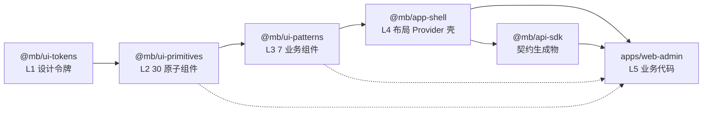

# 附录

> 前端 spec 的术语表、依赖图、缩写词、前后端交叉引用。

---

## 附录 A：术语表

按字母 / 拼音顺序组织。术语的详细定义见对应章节的超链接。

### 架构概念

| 术语 | 定义 | 详见 |
|---|---|---|
| **5 层 package** | meta-build 前端的 pnpm workspace 5 层结构：L1 tokens → L2 primitives → L3 patterns → L4 app-shell → L5 web-admin | [01-layer-structure.md §2](./01-layer-structure.md) |
| **脚手架模式** | meta-build 的分发定位：git 模板仓库（不是 npm 依赖库），使用者 clone 后 L1-L5 全部源码都是自己的资产，可随意修改 | [01-layer-structure.md §3](./01-layer-structure.md) |
| **千人千面** | 同一份业务代码通过切换 L1 主题 + L4 布局壳实现视觉和布局的完全定制，覆盖 80% 定制场景 | [09-customization-workflow.md §6](./09-customization-workflow.md) |
| **双树权限架构** | 路由树（代码扫描产物、只读、sys_route_tree）+ 菜单树（运维自由组织、引用路由树、sys_menu）双树解耦 | [07-menu-permission.md §3](./07-menu-permission.md) |
| **路由树** | `sys_route_tree` 表；前端 Vite 插件扫描 `routes/**/*.tsx` 和 `meta.buttons` 生成的 `route-tree.json`，后端启动时 upsert；代码是单一事实源 | [07-menu-permission.md §4](./07-menu-permission.md) |
| **菜单树** | `sys_menu` 表；运维在后台自由组织的菜单结构，每个节点通过 `route_ref_id` 引用路由树节点（directory 节点为 NULL） | [07-menu-permission.md §5](./07-menu-permission.md) |
| **stale 标记** | 路由树节点的 `is_stale` 字段，表示"代码侧已不再出现"的 fallback 状态（**非**运维软删除；M4.2 后端已去通用软删除） | [07-menu-permission.md §4.4](./07-menu-permission.md) |
| **反向 import** | 低层 package 依赖高层 package 的非法模式（例：L2 import L3）；单向跨级 import（L5 直接 import L2）是合法的 | [10-quality-gates.md §2.2](./10-quality-gates.md) |
| **单向跨级 import** | 高层 package 跳过中间层直接 import 低层（例：L5 直接 import L2 Button）；在 5 层架构里**合法**，不是反向 import | [01-layer-structure.md §4](./01-layer-structure.md) |
| **契约驱动** | 后端 `@RestController` + `@Operation` → springdoc 扫描 → OpenAPI 3.1 JSON → `@mb/api-sdk` 自动生成；前端禁止手写 fetch/axios | [08-contract-client.md §2](./08-contract-client.md) |
| **认证门面** | `useCurrentUser` / `useAuth` hook 在 L4 app-shell 统一管理当前用户状态；features/** 禁止直调 `@mb/api-sdk/auth/*` | [05-app-shell.md §5](./05-app-shell.md) |
| **路由守卫** | `requireAuth({ permission })` 工厂函数，用于 TanStack Router 的 `beforeLoad`；通过 `ensureQueryData` 异步获取当前用户；权限不足 fallback 到登录页 | [06-routing-and-data.md §3](./06-routing-and-data.md) |
| **ensureQueryData** | TanStack Query 的异步缓存保证方法：先查 QueryClient 缓存，命中且未 stale 则直接返回，否则发起请求后返回。在 `beforeLoad` 中用于保证路由守卫能拿到用户数据 | [06-routing-and-data.md §2.4](./06-routing-and-data.md) |
| **代码权威原则** | 权限点定义在代码里（`requireAuth` / `meta.buttons`），数据库 `sys_route_tree.code` 必须在代码清单内；CI 校验 | [07-menu-permission.md §6](./07-menu-permission.md) |
| **AppPermission** | TypeScript 联合类型，列出所有合法的权限码；`type AppPermission = 'order.read' \| 'order.create' \| ...`；编译期保证 `requireAuth` 参数合法 | [07-menu-permission.md §6.2](./07-menu-permission.md) |

### L1 主题 / Token 概念

| 术语 | 定义 | 详见 |
|---|---|---|
| **CSS Variables Only** | meta-build 主题的工程模型：CSS 文件本身是源数据，无 TS/JSON 编译步骤，100% 对齐 shadcn 生态 | [02-ui-tokens-theme.md §2](./02-ui-tokens-theme.md) |
| **扁平命名** | CSS 变量的命名规则：`--color-primary` 而不是 `--colors-primary-500`；为未来可能升级到 JSON 源保留平滑路径 | [02-ui-tokens-theme.md §4](./02-ui-tokens-theme.md) |
| **语义 token** | 46 个面向语义的 CSS 变量（colors / radii / sizes / shadows / motion / fonts），每个主题必须定义全部 | [02-ui-tokens-theme.md §3](./02-ui-tokens-theme.md) |
| **Theme Registry** | `@mb/ui-tokens` 提供的主题注册表（TypeScript 常量），列出所有合法主题 ID：`['default', 'dark', 'compact']` | [02-ui-tokens-theme.md §5.4](./02-ui-tokens-theme.md) |
| **data-theme 切换** | 主题切换机制：`document.documentElement.dataset.theme = 'dark'`；CSS 变量通过 `[data-theme="dark"]` 选择器覆盖 | [02-ui-tokens-theme.md §5.1](./02-ui-tokens-theme.md) |
| **主题完整性脚本** | `scripts/check-theme-integrity.ts`（~90 行 TypeScript 脚本），CI 时校验每个主题定义了全部 46 个语义 token，缺一则失败 | [02-ui-tokens-theme.md §8](./02-ui-tokens-theme.md) |

### L2 / L3 组件概念

| 术语 | 定义 | 详见 |
|---|---|---|
| **CVA** | `class-variance-authority`，L2 原子组件的 variants + size 管理库 | [03-ui-primitives.md §4.1](./03-ui-primitives.md) |
| **shadcn 式文案 props** | L2/L3 组件不消费 i18n（不调 `useTranslation`），所有用户可见文案通过 props 传入（`<Dialog closeLabel={t('common.close')}>`）；L2/L3 天然国际化，可独立使用 | [03-ui-primitives.md §4.3](./03-ui-primitives.md) |
| **asChild 模式** | Radix Slot 的多态技巧；`<Button asChild><Link/></Button>` 让 Button 把样式复用到 Link 上，不渲染额外 DOM | [03-ui-primitives.md §4.6](./03-ui-primitives.md) |
| **Nx 前缀** | L3 业务组件统一命名前缀（`NxTable` / `NxForm` / `NxFilter` ...），区别于 L2 的纯组件名 | [04-ui-patterns.md §3](./04-ui-patterns.md) |
| **L3 不硬编码业务语义** | 订单/客户/商品等业务词汇**不进 L3**；L3 只有通用 props（`dataSource` / `columns` / `value` / `onChange`），业务语义在 L5 注入 | [04-ui-patterns.md §4](./04-ui-patterns.md) |

### L4 壳 / i18n 概念

| 术语 | 定义 | 详见 |
|---|---|---|
| **Provider 树** | L4 app-shell 的全局 Provider 严格 6 层顺序：ErrorBoundary → QueryClientProvider → I18nProvider → ThemeProvider → RouterProvider → Toast/Dialog 容器 | [05-app-shell.md §4.1](./05-app-shell.md) |
| **布局预设** | L4 提供的 3 种布局：SidebarLayout（侧边栏 + 头部）/ TopLayout（顶部导航）/ BasicLayout（登录页无菜单）| [05-app-shell.md §3](./05-app-shell.md) |
| **按层分布的字典** | i18n 字典按层归属使用方：L4 持框架字典（`shell` / `common`），L5 持业务字典（`order.json` / `customer.json` ...），一个业务模块一个 namespace 一个 JSON 文件 | [05-app-shell.md §7.2](./05-app-shell.md) |
| **数据库数据不 i18n** | MUST #6 的边界：代码中的静态文案必须走 `t()`；**但**数据库存储的文案（菜单 name / 字典选项 / 业务数据）永不走 i18n，直接渲染 | [05-app-shell.md §7.10](./05-app-shell.md) |
| **Accept-Language 自动同步** | `@mb/api-sdk` 拦截器自动把 `i18n.language` 填到 HTTP 请求 header，前端切换语言后下一次 API 请求自动协商 | [05-app-shell.md §7.6](./05-app-shell.md) + [08-contract-client.md §4.3](./08-contract-client.md) |
| **useLanguage hook** | L4 提供的语言切换 hook：`localStorage` 持久化 + 不 reload + react-i18next 自动 re-render | [05-app-shell.md §7.4](./05-app-shell.md) |

### 路由 / 数据概念

| 术语 | 定义 | 详见 |
|---|---|---|
| **文件路由** | TanStack Router 的路由声明模式：`apps/web-admin/src/routes/**/*.tsx` 的文件结构**就是**路由树；编译时生成 `routeTree.gen.ts` | [06-routing-and-data.md §2](./06-routing-and-data.md) |
| **loader 模式** | `createFileRoute({ loader: async ({ context }) => ... })`；路由级数据加载，类型完全推导 | [06-routing-and-data.md §4.1](./06-routing-and-data.md) |
| **beforeLoad 鉴权** | 路由级前置钩子，早于 `loader` 运行；权限不足直接 throw redirect | [06-routing-and-data.md §4.2](./06-routing-and-data.md) |
| **meta.buttons** | 路由文件级的按钮权限声明：`createFileRoute({ meta: { buttons: ['order.create', 'order.delete'] } })`；Vite 插件扫描后写入路由树 | [07-menu-permission.md §4.2](./07-menu-permission.md) |

### 契约 / API 概念

| 术语 | 定义 | 详见 |
|---|---|---|
| **ProblemDetail** | RFC 9457 标准的错误响应格式；后端 `GlobalExceptionHandler` 返回 + 前端 `ProblemDetailError` 反序列化 + 按 type/status 分发到 Toast/Dialog/登录页 | [08-contract-client.md §5](./08-contract-client.md) |
| **PageResult** | 分页响应的共享类型：`{ content: T[], totalElements: number, totalPages: number, page: number, size: number }`；前后端共享 | [08-contract-client.md §5.4](./08-contract-client.md) |
| **api-sdk 拦截器** | 前端 HTTP 请求全局拦截器：自动注入 Authorization / Accept-Language / X-Request-ID header | [08-contract-client.md §4](./08-contract-client.md) |

---

## 附录 B：前端依赖图

### B.1 package 级依赖图（mermaid）



- **实线**：标准单向依赖
- **虚线**：允许的单向跨级 import（L5 可以直接 import L2/L3，不是反向 import）

### B.2 核心 Hook 调用链

```
Login 流程：
routes/auth/login.tsx
  → useAuth().login()
    → @mb/api-sdk.authApi.login()
      → 后端 /api/auth/login

当前用户状态：
features/** any component
  → useCurrentUser()
    → useQuery(['auth', 'me'])
      → @mb/api-sdk.authApi.getMe()

菜单渲染：
app-shell Sidebar
  → useMenu()
    → useQuery(['menu'], { staleTime: 1h })
      → @mb/api-sdk.menuApi.queryUserMenu()

路由守卫：
routes/_authed/orders/index.tsx
  → beforeLoad: requireAuth({ permission: 'order.read' })
    → useCurrentUser() 的权限清单
      → 通过则 loader 继续；不通过则 redirect /auth/login

语言切换：
Header LanguageSwitcher
  → useLanguage().changeLanguage('en-US')
    → localStorage.setItem('mb_i18n_lng', 'en-US')
    → i18n.changeLanguage('en-US')
    → react-i18next 自动 re-render 所有 useTranslation 组件
    → 下一次 @mb/api-sdk 请求自动带 Accept-Language: en-US
```

### B.3 契约驱动链路

```
后端代码（Spring Boot）
  ↓ @RestController + @Operation + @RequestBody/@RequestParam
  ↓
springdoc-openapi 扫描
  ↓
openapi.json（OpenAPI 3.1 规范，入 git）
  ↓
OpenAPI Generator (typescript-fetch / typescript-axios)
  ↓
@mb/api-sdk（不入 git，CI/本地构建生成）
  ↓ 类型：interface OrderDto / interface PageResult<T> / ProblemDetail
  ↓ 方法：orderApi.list / orderApi.create / orderApi.update / orderApi.delete
  ↓
apps/web-admin 业务代码 + @mb/app-shell 认证门面
  ↓
运行时请求拦截器注入 Authorization / Accept-Language / X-Request-ID
  ↓
HTTP 请求 → 后端
```

---

## 附录 C：缩写词

| 缩写 | 全称 | 说明 |
|---|---|---|
| **CVA** | class-variance-authority | L2 原子组件的 variants 管理库（shadcn 生态标配） |
| **HMR** | Hot Module Replacement | Vite 开发时模块热替换 |
| **JIT** | Just-In-Time | Tailwind CSS 按需生成 class 模式（在 build 阶段扫源码）|
| **L1-L5** | Layer 1 ~ Layer 5 | meta-build 前端分层编号 |
| **M0-M7** | Milestone 0 ~ Milestone 7 | meta-build 整体实施 milestone（M0 文档；M1 脚手架；M2 L1+Theme；M3 L2+L3+L4+L5；M4 后端；M5 canonical reference；M6 验证层；M7 开源） |
| **MUST / MUST NOT** | — | 硬约束分类：必须 / 禁止，共 13 条硬约束（6 MUST NOT + 7 MUST）+ 2 条推荐 |
| **OpenAPI** | OpenAPI Specification 3.1 | REST API 契约规范，meta-build 前后端契约的单一事实源 |
| **RBAC** | Role-Based Access Control | 基于角色的访问控制模型 |
| **RFC 9457** | Problem Details for HTTP APIs | 后端错误响应格式标准（`ProblemDetail` 类型的来源） |
| **RHF** | React Hook Form | L3 NxForm 的底层表单库 |
| **SPA** | Single-Page Application | 单页应用（meta-build v1 的前端形态） |
| **SSR** | Server-Side Rendering | 服务端渲染（meta-build v1 **不做**；未来可能考虑） |
| **shadcn** | shadcn/ui | 源码模板式组件库；meta-build L2 对齐它的生态哲学 |
| **TS strict** | TypeScript strict mode | 严格模式（`"strict": true`），meta-build 前端必开 |
| **YAGNI** | You Aren't Gonna Need It | "你不会需要它"——meta-build 的工程原则之一，反对过度设计 |

---

## 附录 D：前后端交叉引用表

| 前端概念 | 后端对应 | 对应关系 | 前端 spec | 后端 spec |
|---|---|---|---|---|
| `requireAuth({ permission })` 路由守卫 | `@RequirePermission(...)` 注解 | 共享同一份 `AppPermission` code 清单；CI 校验 | [06-routing-and-data.md §3](./06-routing-and-data.md) + [07-menu-permission.md §6.2](./07-menu-permission.md) | [backend/05-security.md §2](../backend/05-security.md) |
| `useCurrentUser()` hook | `CurrentUser` 门面接口 | 当前用户信息的读门面；前后端对称 | [05-app-shell.md §5.1](./05-app-shell.md) | [backend/05-security.md §6](../backend/05-security.md) |
| `useAuth().login/logout` hook | `AuthFacade` 门面接口 | 登录/登出/强制注销的写门面 | [05-app-shell.md §5.2](./05-app-shell.md) | [backend/05-security.md §6.6](../backend/05-security.md) |
| `useMenu()` hook + 双树架构 | `sys_menu` + `sys_route_tree` 表 + `MenuApi` | 菜单树查询 + 路由树启动同步 | [07-menu-permission.md](./07-menu-permission.md) 全文 | [backend/03-platform-modules.md](../backend/03-platform-modules.md) platform-iam |
| Vite 插件生成 `route-tree.json` | 后端启动时 `RouteTreeSyncRunner` 读取并 upsert 到 `sys_route_tree` | 路由树代码扫描同步；代码是单一事实源 | [07-menu-permission.md §4.2](./07-menu-permission.md) | [backend/03-platform-modules.md](../backend/03-platform-modules.md) platform-iam |
| `@mb/api-sdk` 自动生成 | `springdoc-openapi` + OpenAPI 3.1 | 契约驱动的唯一路径 | [08-contract-client.md §2](./08-contract-client.md) | [backend/06-api-and-contract.md](../backend/06-api-and-contract.md) |
| `Accept-Language` 拦截器 | `MessageSource` + `LocaleResolver` | 前后端 i18n 协同；数据库业务数据按 locale 返回 | [05-app-shell.md §7.6](./05-app-shell.md) + [08-contract-client.md §4.3](./08-contract-client.md) | [backend/06-api-and-contract.md §4](../backend/06-api-and-contract.md) |
| `ProblemDetailError` 反序列化 + 全局错误中间件 | `GlobalExceptionHandler` + RFC 9457 | 错误响应的统一格式；前端按 type/status 分发 | [08-contract-client.md §5](./08-contract-client.md) | [backend/06-api-and-contract.md §3](../backend/06-api-and-contract.md) |
| `PageResult<T>` 类型约束 | `PageResult<T>` DTO | 分页响应的共享类型 | [08-contract-client.md §5.4](./08-contract-client.md) | [backend/06-api-and-contract.md §3](../backend/06-api-and-contract.md) |
| 认证门面豁免（`routes/auth/**` 可直调 api-sdk） | —（纯前端约束） | `features/**` 禁止直调 `@mb/api-sdk/auth/*` 状态接口；登录流程豁免 | [08-contract-client.md §6](./08-contract-client.md) | — |
| `X-Request-ID` 前端注入 traceId | 后端日志 MDC 记录 traceId | 前端生成 UUID → 后端 traceId 贯通全链路 | [08-contract-client.md §4.4](./08-contract-client.md) | [backend/07-observability-testing.md](../backend/07-observability-testing.md) |

详细交叉引用说明见各子文件对应章节。

---

[← 返回 README](./README.md)
